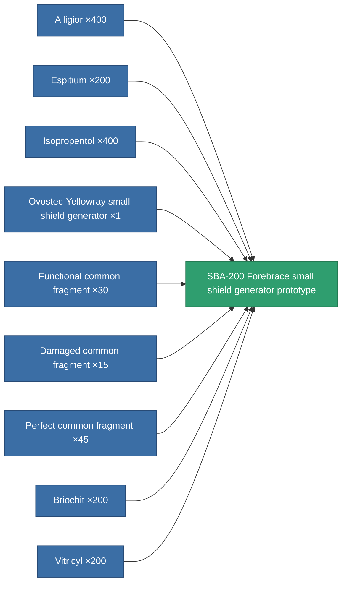

<!-- Generated by tools/generate from the live database (source: entitydefaults definition 2206, aggregatevalues via aggregatefields).
     Do not edit by hand; regenerate instead. -->

# SBA-200 Forebrace small shield generator prototype

|  |  |
|---|---|
| Definition | `def_named3_small_shield_generator_pr` |
| Tier | T4 (prototype) |
| Health | 100 |
| Volume | 0.3 |
| Mass | 172.5 |
| Category | Modules / Shield |
| Tier line | [Standard small shield generator](/content/items/standard-small-shield-generator/) (T1) → [Parsvaal-IP small shield generator](/content/items/named1-small-shield-generator/) (T2) → [Ovostec-Yellowray small shield generator](/content/items/named2-small-shield-generator/) (T3) → [SBA-200 Forebrace small shield generator](/content/items/named3-small-shield-generator/) (T4) → **SBA-200 Forebrace small shield generator prototype** (T4) |

## Stats

| Field | Value |
|---|---|
| core_usage | 1 |
| cpu_usage | 48 |
| cycle_time | 2k |
| powergrid_usage | 54 |
| shield_absorbtion | 2 |
| shield_radius | 6 |

<!-- production:generated -->
## Production

**Produced from 9 components, research level 5** — assemble the components to build it (see [Recipes](/content/recipes/) for the full list):

[All items](/content/items/)
