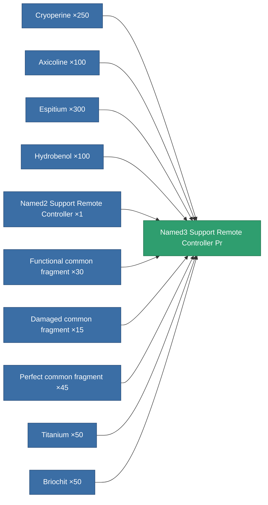

<!-- Generated by tools/generate from the live database (source: entitydefaults definition 8588, aggregatevalues via aggregatefields).
     Do not edit by hand; regenerate instead. -->

# Named3 Support Remote Controller Pr

|  |  |
|---|---|
| Definition | `def_named3_support_remote_controller_pr` |
| Tier | T4 (prototype) |
| Health | 100 |
| Volume | 1 |
| Mass | 1 |
| Category | Modules / Remote control |
| Tier line | [Standard Support Remote Controller](/content/items/standard-support-remote-controller/) (T1) → [Named1 Support Remote Controller](/content/items/named1-support-remote-controller/) (T2) → [Named2 Support Remote Controller](/content/items/named2-support-remote-controller/) (T3) → [Named3 Support Remote Controller](/content/items/named3-support-remote-controller/) (T4) → **Named3 Support Remote Controller Pr** (T4) |

## Stats

| Field | Value |
|---|---|
| core_usage | 180 |
| cpu_usage | 65 |
| cycle_time | 5k |
| drone_amplification_armor_max_modifier | 1 |
| drone_amplification_core_max_modifier | 1 |
| drone_amplification_core_recharge_time_modifier | 1 |
| drone_amplification_locking_time_modifier | 1 |
| drone_amplification_reactor_radiation_modifier | 1 |
| drone_amplification_remote_repair_amount_modifier | 1 |
| drone_amplification_remote_repair_cycle_time_modifier | 1 |
| drone_amplification_speed_max_modifier | 1 |
| optimal_range | 30 |
| powergrid_usage | 67 |
| remote_control_bandwidth_max | 0 |
| remote_control_lifetime | 300k |
| remote_control_operational_range | 30 |

<!-- production:generated -->
## Production

**Produced from 10 components, research level 8** — assemble the components to build it (see [Recipes](/content/recipes/) for the full list):

[All items](/content/items/)
