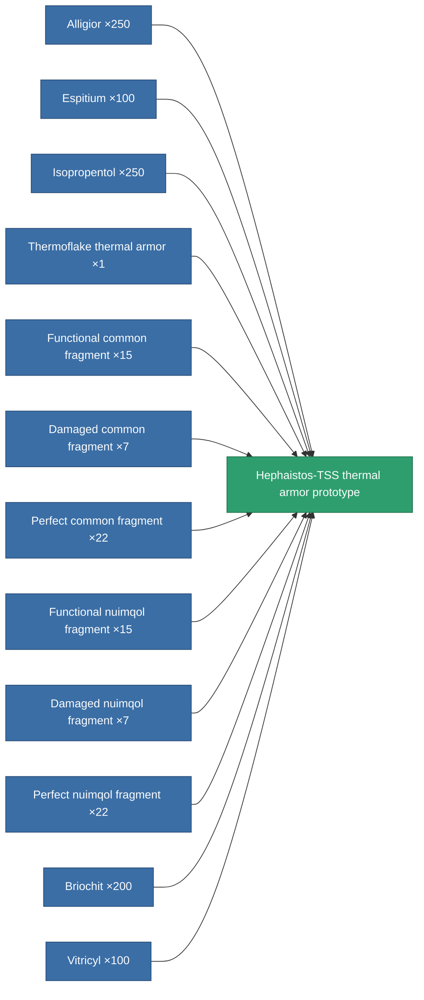

<!-- Generated by tools/generate from the live database (source: entitydefaults definition 2200, aggregatevalues via aggregatefields).
     Do not edit by hand; regenerate instead. -->

# Hephaistos-TSS thermal armor prototype

|  |  |
|---|---|
| Definition | `def_named3_thrm_armor_hardener_pr` |
| Tier | 4 |
| Health | 100 |
| Volume | 1 |
| Mass | 75 |
| Category | Modules / Armor |

## Stats

| Field | Value |
|---|---|
| core_usage | 12 |
| cpu_usage | 26 |
| cycle_time | 10k |
| effect_resist_thermal | 125 |
| powergrid_usage | 6 |
| resist_thermal | 25 |

<!-- production:generated -->
## Production

**Produced from 12 components, research level 6** — assemble the components to build it (see [Recipes](/content/recipes/) for the full list):

[All items](/content/items/)
