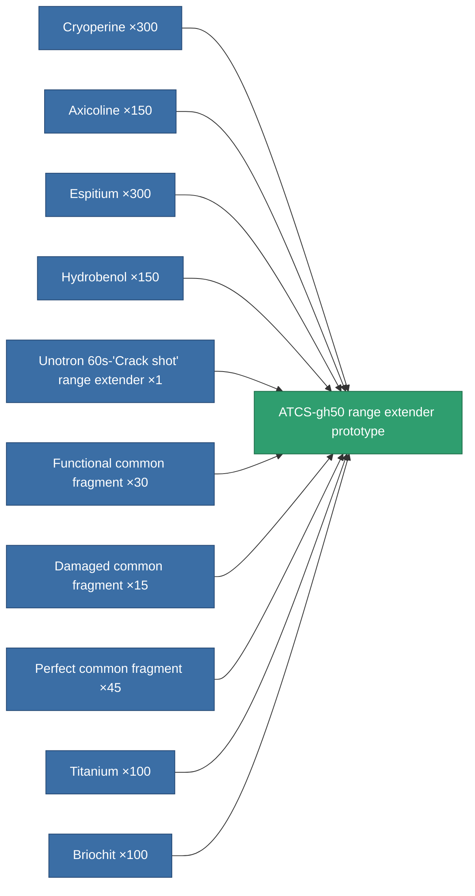

<!-- Generated by tools/generate from the live database (source: entitydefaults definition 2332, aggregatevalues via aggregatefields).
     Do not edit by hand; regenerate instead. -->

# ATCS-gh50 range extender prototype

|  |  |
|---|---|
| Definition | `def_named3_tracking_upgrade_pr` |
| Tier | T4 (prototype) |
| Health | 100 |
| Volume | 0.1 |
| Mass | 37.5 |
| Category | Modules / Enhancements |
| Tier line | [Standard range extender](/content/items/standard-tracking-upgrade/) (T1) → [Opaletrak range extender](/content/items/named1-tracking-upgrade/) (T2) → [Unotron 60s-'Crack shot' range extender](/content/items/named2-tracking-upgrade/) (T3) → [ATCS-gh50 range extender](/content/items/named3-tracking-upgrade/) (T4) → **ATCS-gh50 range extender prototype** (T4) |

## Stats

| Field | Value |
|---|---|
| cpu_usage | 38 |
| optimal_range_modifier | 1.15 |
| powergrid_usage | 119 |

<!-- production:generated -->
## Production

**Produced from 10 components, research level 6** — assemble the components to build it (see [Recipes](/content/recipes/) for the full list):

[All items](/content/items/)
