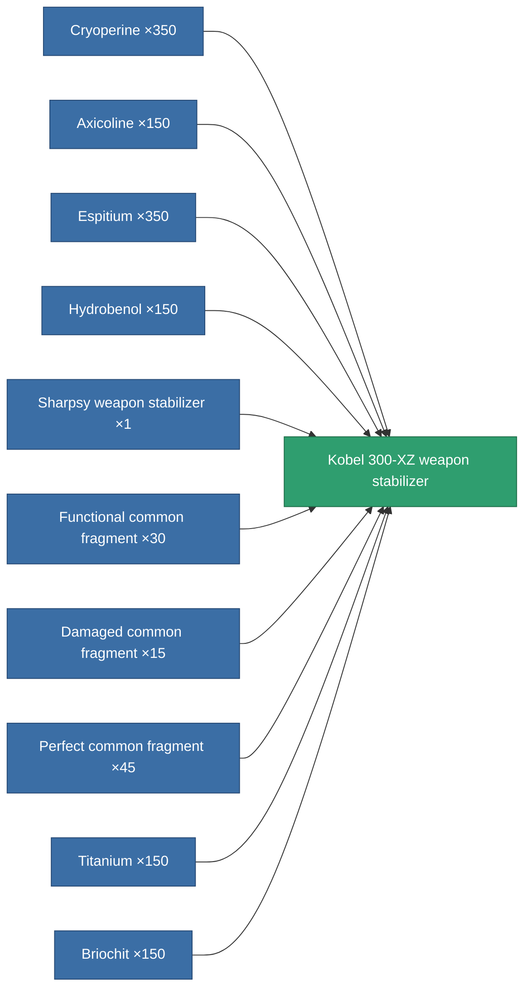

<!-- Generated by tools/generate from the live database (source: entitydefaults definition 3384, aggregatevalues via aggregatefields).
     Do not edit by hand; regenerate instead. -->

# Kobel 300-XZ weapon stabilizer

|  |  |
|---|---|
| Definition | `def_named3_weapon_stabilizer` |
| Tier | T4 |
| Health | 100 |
| Volume | 1 |
| Mass | 525 |
| Category | Modules / Weapons |
| Tier line | [Standard weapon stabilizer](/content/items/standard-weapon-stabilizer/) (T1) → [Kobel 450-TZ weapon stabilizer](/content/items/named1-weapon-stabilizer/) (T2) → [Sharpsy weapon stabilizer](/content/items/named2-weapon-stabilizer/) (T3) → **Kobel 300-XZ weapon stabilizer** (T4) |

## Stats

| Field | Value |
|---|---|
| accuracy_modifier | 0.85 |
| cpu_usage | 40 |
| explosion_radius_modifier | 0.85 |
| massiveness | -0.05 |
| powergrid_usage | 25 |

<!-- production:generated -->
## Production

**Produced from 10 components, research level 7** — assemble the components to build it (see [Recipes](/content/recipes/) for the full list):

[All items](/content/items/)
