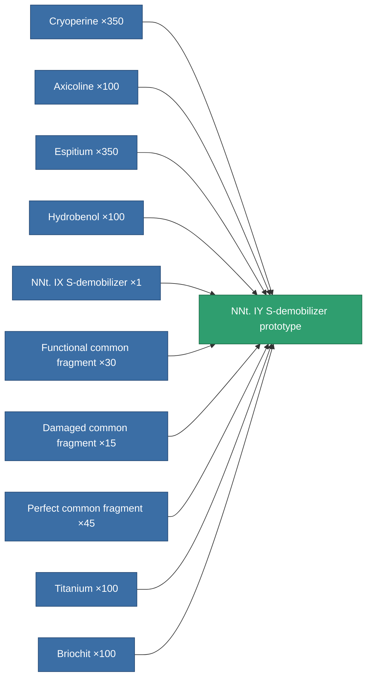

<!-- Generated by tools/generate from the live database (source: entitydefaults definition 2257, aggregatevalues via aggregatefields).
     Do not edit by hand; regenerate instead. -->

# NNt. IY S-demobilizer prototype

|  |  |
|---|---|
| Definition | `def_named3_webber_pr` |
| Tier | 4 |
| Health | 100 |
| Volume | 0.5 |
| Mass | 75 |
| Category | Modules / Enhancements |

## Stats

| Field | Value |
|---|---|
| core_usage | 18 |
| cpu_usage | 48 |
| cycle_time | 5k |
| effect_massivness_speed_max_modifier | 0.55 |
| falloff | 0 |
| optimal_range | 15 |
| powergrid_usage | 15 |

<!-- production:generated -->
## Production

**Produced from 10 components, research level 6** — assemble the components to build it (see [Recipes](/content/recipes/) for the full list):

[All items](/content/items/)
