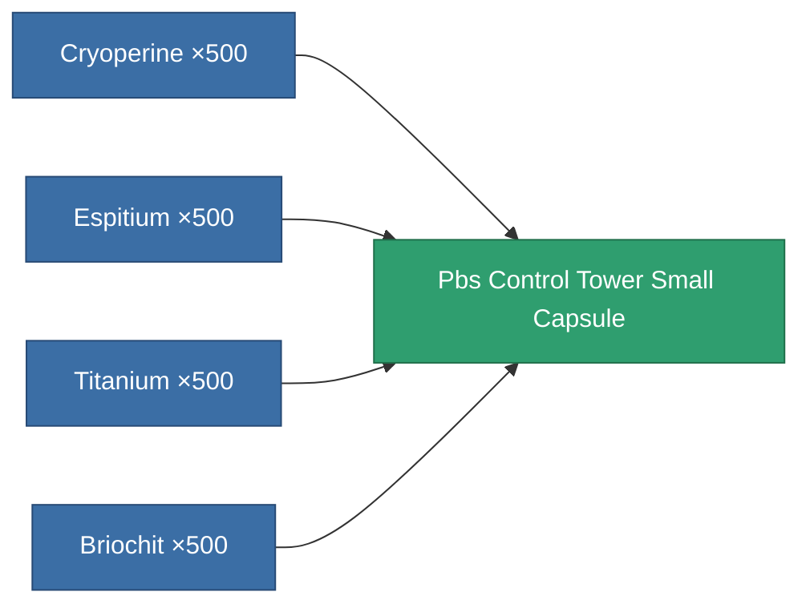
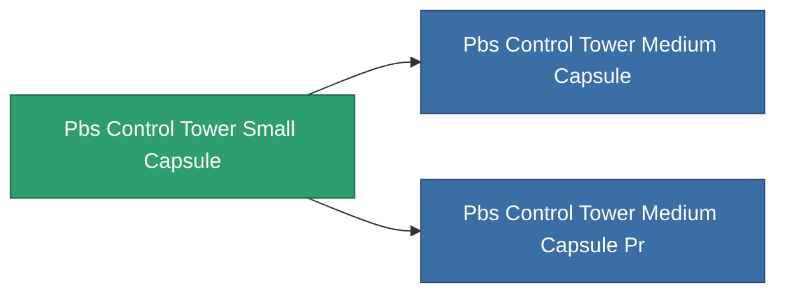

<!-- Generated by tools/generate from the live database (source: entitydefaults definition 4700, aggregatevalues via aggregatefields).
     Do not edit by hand; regenerate instead. -->

# Pbs Control Tower Small Capsule

|  |  |
|---|---|
| Definition | `def_pbs_control_tower_small_capsule` |
| Tier | T1 |
| Health | 100 |
| Volume | 10 |
| Mass | 10000 |
| Category | Special & other / Miscellaneous |

## Stats

| Field | Value |
|---|---|
| armor_max | 50k |
| resist_chemical | 30 |
| resist_explosive | 30 |
| resist_kinetic | 30 |
| resist_thermal | 30 |
| signature_radius | 20 |
| stealth_strength | 50 |

<!-- production:generated -->
## Production

**Produced from 4 components** — assemble the components to build it (see [Recipes](/content/recipes/) for the full list):

## Used in production

**Component of 2 items** — everything that uses it in production:

[All items](/content/items/)
