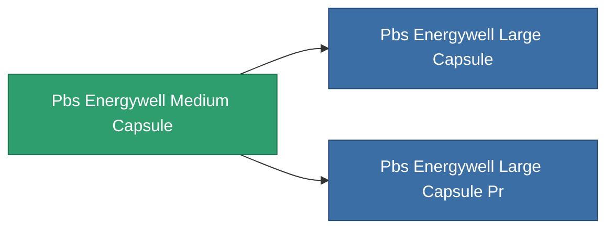

<!-- Generated by tools/generate from the live database (source: entitydefaults definition 5356, aggregatevalues via aggregatefields).
     Do not edit by hand; regenerate instead. -->

# Pbs Energywell Medium Capsule

|  |  |
|---|---|
| Definition | `def_pbs_energywell_medium_capsule` |
| Tier | 2 |
| Health | 100 |
| Volume | 225 |
| Mass | 225000 |
| Category | Special & other / Miscellaneous |

## Stats

| Field | Value |
|---|---|
| armor_max | 25k |
| core_max | 20M |
| core_recharge_time | 345.6k |
| resist_chemical | 75 |
| resist_explosive | 75 |
| resist_kinetic | 75 |
| resist_thermal | 75 |
| signature_radius | 25 |
| stealth_strength | 50 |

<!-- production:generated -->
## Production

**Component of 2 items** — everything that uses it in production:

[All items](/content/items/)
