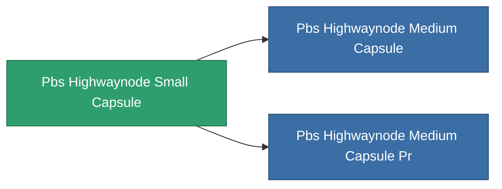

<!-- Generated by tools/generate from the live database (source: entitydefaults definition 5367, aggregatevalues via aggregatefields).
     Do not edit by hand; regenerate instead. -->

# Pbs Highwaynode Small Capsule

|  |  |
|---|---|
| Definition | `def_pbs_highwaynode_small_capsule` |
| Tier | 1 |
| Health | 100 |
| Volume | 20 |
| Mass | 150000 |
| Category | Special & other / Miscellaneous |

## Stats

| Field | Value |
|---|---|
| armor_max | 10k |
| core_max | 3k |
| core_recharge_time | 345.6k |
| resist_chemical | 150 |
| resist_explosive | 150 |
| resist_kinetic | 150 |
| resist_thermal | 150 |
| signature_radius | 50 |
| stealth_strength | 50 |

<!-- production:generated -->
## Production

**Component of 2 items** — everything that uses it in production:

[All items](/content/items/)
