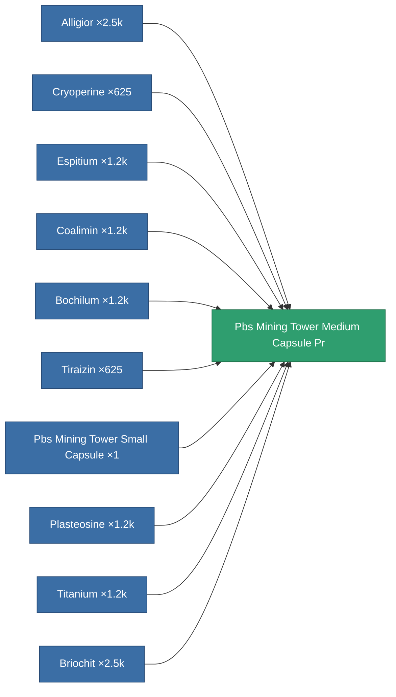

<!-- Generated by tools/generate from the live database (source: entitydefaults definition 6735, aggregatevalues via aggregatefields).
     Do not edit by hand; regenerate instead. -->

# Pbs Mining Tower Medium Capsule Pr

|  |  |
|---|---|
| Definition | `def_pbs_mining_tower_medium_capsule_pr` |
| Tier | 2 |
| Health | 100 |
| Volume | 15 |
| Mass | 15000 |
| Category | Special & other / Miscellaneous |
| Note | PBS CAPSULE PROTOTYPE DEF |

## Stats

| Field | Value |
|---|---|
| armor_max | 125k |
| core_max | 27.5k |
| resist_chemical | 75 |
| resist_explosive | 75 |
| resist_kinetic | 75 |
| resist_thermal | 75 |
| signature_radius | 37.5 |
| stealth_strength | 50 |

<!-- production:generated -->
## Production

**Produced from 10 components, research level 5** — assemble the components to build it (see [Recipes](/content/recipes/) for the full list):

[All items](/content/items/)
