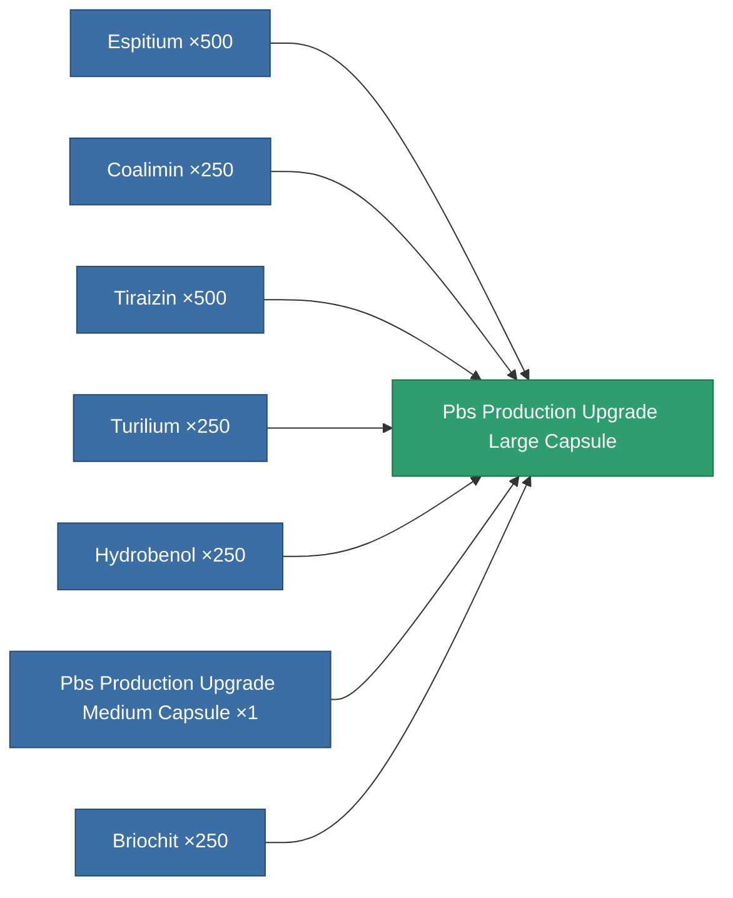

<!-- Generated by tools/generate from the live database (source: entitydefaults definition 4715, aggregatevalues via aggregatefields).
     Do not edit by hand; regenerate instead. -->

# Pbs Production Upgrade Large Capsule

|  |  |
|---|---|
| Definition | `def_pbs_production_upgrade_large_capsule` |
| Tier | 3 |
| Health | 100 |
| Volume | 20 |
| Mass | 20000 |
| Category | Special & other / Miscellaneous |

## Stats

| Field | Value |
|---|---|
| armor_max | 45k |
| core_max | 750 |
| resist_chemical | 120 |
| resist_explosive | 120 |
| resist_kinetic | 120 |
| resist_thermal | 120 |
| signature_radius | 30 |
| stealth_strength | 50 |

<!-- production:generated -->
## Production

**Produced from 7 components** — assemble the components to build it (see [Recipes](/content/recipes/) for the full list):

[All items](/content/items/)
