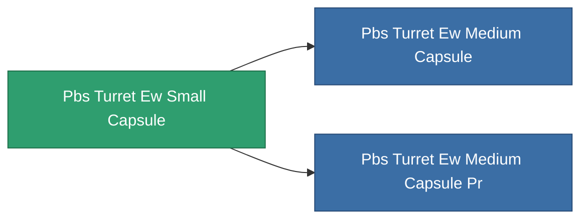

<!-- Generated by tools/generate from the live database (source: entitydefaults definition 5164, aggregatevalues via aggregatefields).
     Do not edit by hand; regenerate instead. -->

# Pbs Turret Ew Small Capsule

|  |  |
|---|---|
| Definition | `def_pbs_turret_ew_small_capsule` |
| Tier | T1 |
| Health | 100 |
| Volume | 5 |
| Mass | 5000 |
| Category | Special & other / Miscellaneous |

## Stats

| Field | Value |
|---|---|
| armor_max | 45k |
| core_max | 2.5k |
| cycle_time | 1 |
| damage_modifier | 0.4 |
| detection_strength | 135 |
| ecm_strength_modifier | 0.85 |
| energy_neutralized_amount_modifier | 0.5 |
| ew_optimal_range_modifier | 0.85 |
| falloff_modifier | 1.6 |
| locking_range_modifier | 1.35 |
| missile_falloff_modifier | 1.6 |
| optimal_range_modifier | 0.85 |
| resist_chemical | 180 |
| resist_explosive | 180 |
| resist_kinetic | 180 |
| resist_thermal | 180 |
| sensor_strength | 160 |
| signature_radius | 12 |
| stealth_strength | 80 |
| turret_fallof_modifier | 1.6 |

<!-- production:generated -->
## Production

**Produced from 6 components** — assemble the components to build it (see [Recipes](/content/recipes/) for the full list):

<svg class="prod-card-icon" aria-hidden="true"><use href="#mi-grid"/></svg><a class="prod-card-name" href="/content/items/axicol/">Cryoperine</a>

required: <b>500</b>

<svg class="prod-card-icon" aria-hidden="true"><use href="#mi-grid"/></svg><a class="prod-card-name" href="/content/items/axicoline/">Axicoline</a>

required: <b>750</b>

<svg class="prod-card-icon" aria-hidden="true"><use href="#mi-grid"/></svg><a class="prod-card-name" href="/content/items/espitium/">Espitium</a>

required: <b>500</b>

<svg class="prod-card-icon" aria-hidden="true"><use href="#mi-grid"/></svg><a class="prod-card-name" href="/content/items/hydrobenol/">Hydrobenol</a>

required: <b>750</b>

<svg class="prod-card-icon" aria-hidden="true"><use href="#mi-grid"/></svg><a class="prod-card-name" href="/content/items/titanium/">Titanium</a>

required: <b>100</b>

<svg class="prod-card-icon" aria-hidden="true"><use href="#mi-grid"/></svg><a class="prod-card-name" href="/content/items/unimetal/">Briochit</a>

required: <b>100</b>

## Used in production

**Component of 2 items** — everything that uses it in production:

