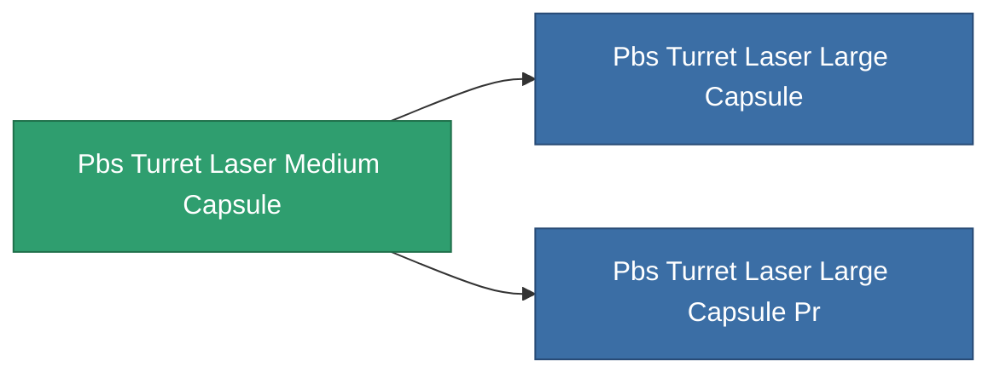

<!-- Generated by tools/generate from the live database (source: entitydefaults definition 4820, aggregatevalues via aggregatefields).
     Do not edit by hand; regenerate instead. -->

# Pbs Turret Laser Medium Capsule

|  |  |
|---|---|
| Definition | `def_pbs_turret_laser_medium_capsule` |
| Tier | T2 |
| Health | 100 |
| Volume | 7 |
| Mass | 7000 |
| Category | Special & other / Miscellaneous |

## Stats

| Field | Value |
|---|---|
| armor_max | 67.5k |
| core_max | 2.5k |
| cycle_time | 0.7 |
| damage_modifier | 0.6 |
| detection_strength | 125 |
| ecm_strength_modifier | 0.9 |
| energy_neutralized_amount_modifier | 0.7 |
| ew_optimal_range_modifier | 0.9 |
| falloff_modifier | 1.8 |
| locking_range_modifier | 1.425 |
| missile_falloff_modifier | 1.8 |
| optimal_range_modifier | 1 |
| resist_chemical | 240 |
| resist_explosive | 240 |
| resist_kinetic | 240 |
| resist_thermal | 240 |
| sensor_strength | 180 |
| signature_radius | 18 |
| stealth_strength | 80 |
| turret_fallof_modifier | 1.8 |

<!-- production:generated -->
## Production

**Produced from 10 components** — assemble the components to build it (see [Recipes](/content/recipes/) for the full list):

<svg class="prod-card-icon" aria-hidden="true"><use href="#mi-grid"/></svg><a class="prod-card-name" href="/content/items/axicol/">Cryoperine</a>

required: <b>250</b>

<svg class="prod-card-icon" aria-hidden="true"><use href="#mi-grid"/></svg><a class="prod-card-name" href="/content/items/axicoline/">Axicoline</a>

required: <b>375</b>

<svg class="prod-card-icon" aria-hidden="true"><use href="#mi-grid"/></svg><a class="prod-card-name" href="/content/items/espitium/">Espitium</a>

required: <b>500</b>

<svg class="prod-card-icon" aria-hidden="true"><use href="#mi-grid"/></svg><a class="prod-card-name" href="/content/items/gamma-buildblock/">Coalimin</a>

required: <b>50</b>

<svg class="prod-card-icon" aria-hidden="true"><use href="#mi-grid"/></svg><a class="prod-card-name" href="/content/items/gamma-energyblock/">Tiraizin</a>

required: <b>250</b>

<svg class="prod-card-icon" aria-hidden="true"><use href="#mi-grid"/></svg><a class="prod-card-name" href="/content/items/gamma-offenseblock/">Turilium</a>

required: <b>375</b>

<svg class="prod-card-icon" aria-hidden="true"><use href="#mi-grid"/></svg><a class="prod-card-name" href="/content/items/hydrobenol/">Hydrobenol</a>

required: <b>750</b>

<svg class="prod-card-icon" aria-hidden="true"><use href="#mi-home"/></svg><a class="prod-card-name" href="/content/items/pbs-turret-laser-small-capsule/">Pbs Turret Laser Small Capsule</a>

required: <b>1</b>

<svg class="prod-card-icon" aria-hidden="true"><use href="#mi-grid"/></svg><a class="prod-card-name" href="/content/items/titanium/">Titanium</a>

required: <b>50</b>

<svg class="prod-card-icon" aria-hidden="true"><use href="#mi-grid"/></svg><a class="prod-card-name" href="/content/items/unimetal/">Briochit</a>

required: <b>100</b>

## Used in production

**Component of 2 items** — everything that uses it in production:

