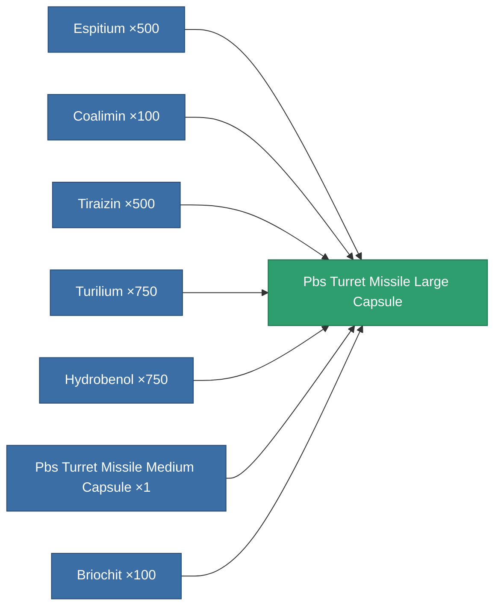

<!-- Generated by tools/generate from the live database (source: entitydefaults definition 4832, aggregatevalues via aggregatefields).
     Do not edit by hand; regenerate instead. -->

# Pbs Turret Missile Large Capsule

|  |  |
|---|---|
| Definition | `def_pbs_turret_missile_large_capsule` |
| Tier | T3 |
| Health | 100 |
| Volume | 10 |
| Mass | 10000 |
| Category | Special & other / Miscellaneous |

## Stats

| Field | Value |
|---|---|
| armor_max | 75k |
| core_max | 2.5k |
| cycle_time | 1 |
| damage_modifier | 1 |
| detection_strength | 125 |
| ecm_strength_modifier | 1 |
| energy_neutralized_amount_modifier | 1 |
| ew_optimal_range_modifier | 1 |
| falloff_modifier | 2 |
| locking_range_modifier | 1.5 |
| missile_falloff_modifier | 2 |
| optimal_range_modifier | 1 |
| resist_chemical | 300 |
| resist_explosive | 300 |
| resist_kinetic | 300 |
| resist_thermal | 300 |
| sensor_strength | 200 |
| signature_radius | 30 |
| stealth_strength | 80 |
| turret_fallof_modifier | 2 |

<!-- production:generated -->
## Production

**Produced from 7 components** — assemble the components to build it (see [Recipes](/content/recipes/) for the full list):

[All items](/content/items/)
