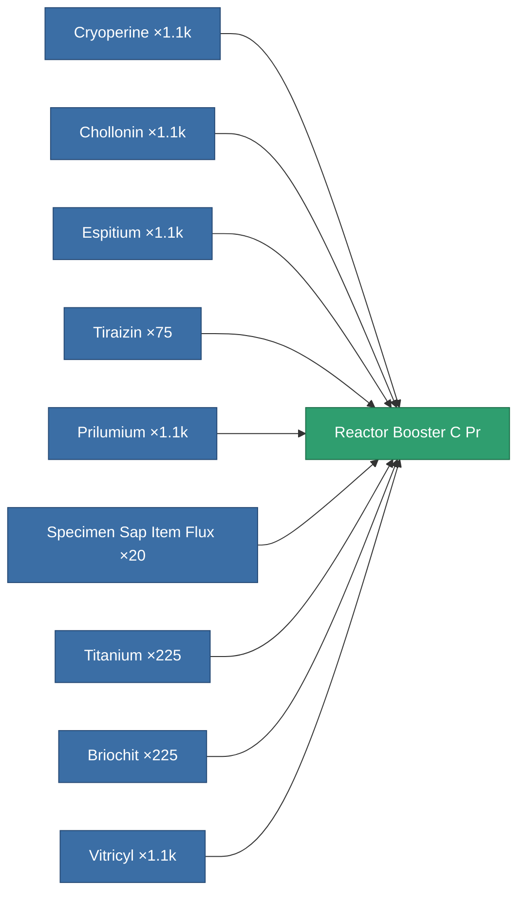

<!-- Generated by tools/generate from the live database (source: entitydefaults definition 6114, aggregatevalues via aggregatefields).
     Do not edit by hand; regenerate instead. -->

# Reactor Booster C Pr

|  |  |
|---|---|
| Definition | `def_reactor_booster_c_pr` |
| Tier | T3 (prototype) |
| Health | 100 |
| Volume | 25 |
| Mass | 15000 |
| Category | Materials |
| Note | Reactor fuel rods |

_No stats — this item carries no aggregate values._

<!-- production:generated -->
## Production

**Produced from 9 components, research level 6** — assemble the components to build it (see [Recipes](/content/recipes/) for the full list):

[All items](/content/items/)
