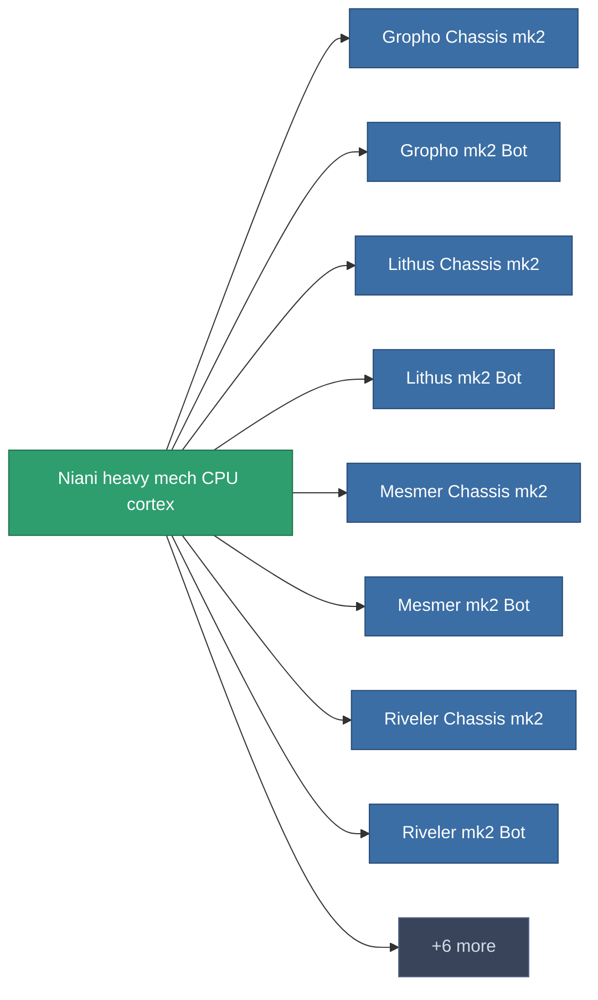

<!-- Generated by tools/generate from the live database (source: entitydefaults definition 2946, aggregatevalues via aggregatefields).
     Do not edit by hand; regenerate instead. -->

# Niani heavy mech CPU cortex

|  |  |
|---|---|
| Definition | `def_reactore_core_heavymech` |
| Tier | – |
| Health | 100 |
| Volume | 2 |
| Mass | 4000 |
| Category | Materials |

_No stats — this item carries no aggregate values._

<!-- production:generated -->
## Production

**Component of 14 items** — a sample of what can be produced with it (the full list is in [Recipes](/content/recipes/)).

[All items](/content/items/)
