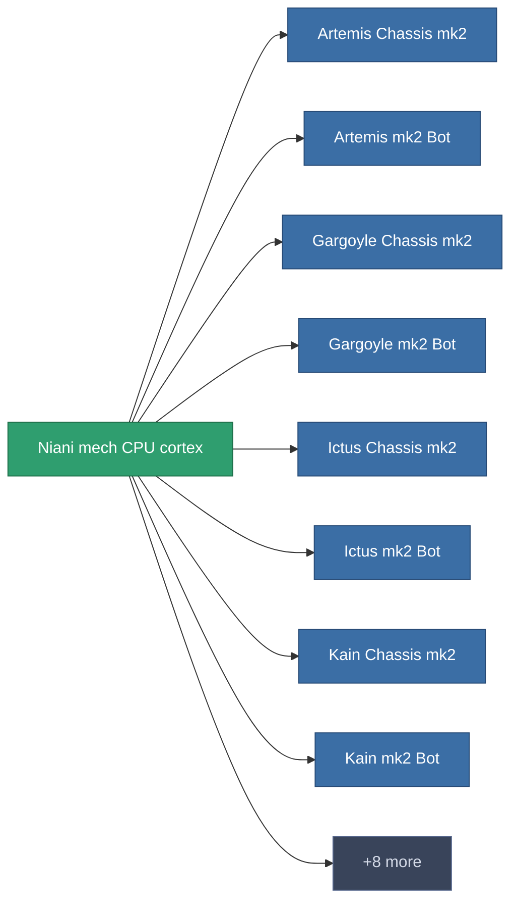

<!-- Generated by tools/generate from the live database (source: entitydefaults definition 2945, aggregatevalues via aggregatefields).
     Do not edit by hand; regenerate instead. -->

# Niani mech CPU cortex

|  |  |
|---|---|
| Definition | `def_reactore_core_mech` |
| Tier | – |
| Health | 100 |
| Volume | 1.5 |
| Mass | 2000 |
| Category | Materials |

_No stats — this item carries no aggregate values._

<!-- production:generated -->
## Production

**Component of 16 items** — a sample of what can be produced with it (the full list is in [Recipes](/content/recipes/)).

[All items](/content/items/)
