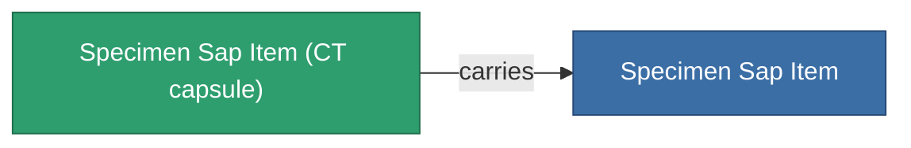
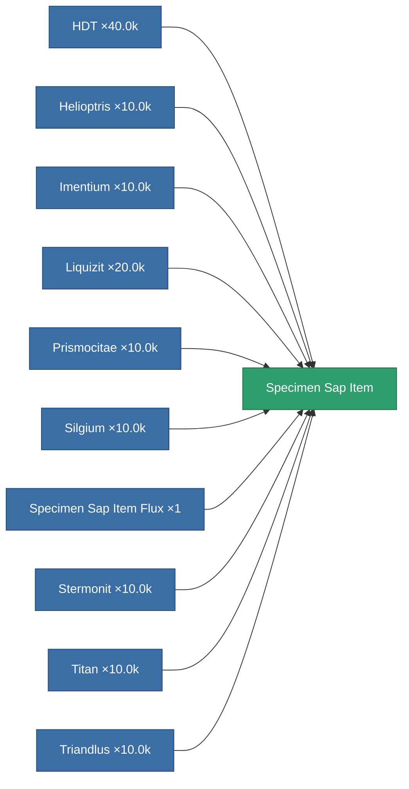

<!-- Generated by tools/generate from the live database (source: entitydefaults definition 5691, aggregatevalues via aggregatefields).
     Do not edit by hand; regenerate instead. -->

# Specimen Sap Item

|  |  |
|---|---|
| Definition | `def_specimen_sap_item` |
| Tier | 1 |
| Health | 100 |
| Volume | 16 |
| Mass | 16 |
| Category | Materials |
| Note | Specimen Item |

_No stats — this item carries no aggregate values._

## Transport capsule

A transport capsule (CT) exists for this item — it is how the item moves between players and zones.

<!-- production:generated -->
## Production

**Produced from 10 components** — assemble the components to build it (see [Recipes](/content/recipes/) for the full list):

[All items](/content/items/)
