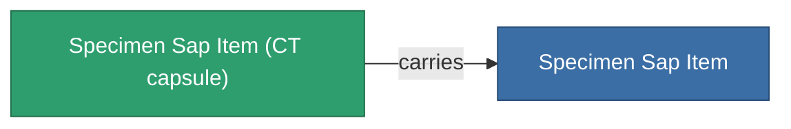

<!-- Generated by tools/generate from the live database (source: entitydefaults definition 5691, aggregatevalues via aggregatefields).
     Do not edit by hand; regenerate instead. -->

# Specimen Sap Item

|  |  |
|---|---|
| Definition | `def_specimen_sap_item` |
| Tier | T1 |
| Health | 100 |
| Volume | 16 |
| Mass | 16 |
| Category | Materials |
| Note | Specimen Item |

_No stats — this item carries no aggregate values._

## Transport capsule

A transport capsule (CT) exists for this item — it is how the item moves between players and zones.

<!-- production:generated -->
## Production

**Produced from 10 components** — assemble the components to build it (see [Recipes](/content/recipes/) for the full list):

<svg class="prod-card-icon" aria-hidden="true"><use href="#mi-grid"/></svg><a class="prod-card-name" href="/content/items/crude/">HDT</a>

required: <b>40.0k</b>

<svg class="prod-card-icon" aria-hidden="true"><use href="#mi-grid"/></svg><a class="prod-card-name" href="/content/items/helioptris/">Helioptris</a>

required: <b>10.0k</b>

<svg class="prod-card-icon" aria-hidden="true"><use href="#mi-grid"/></svg><a class="prod-card-name" href="/content/ores/imentium/">Imentium</a>

required: <b>10.0k</b>

<svg class="prod-card-icon" aria-hidden="true"><use href="#mi-grid"/></svg><a class="prod-card-name" href="/content/items/liquizit/">Liquizit</a>

required: <b>20.0k</b>

<svg class="prod-card-icon" aria-hidden="true"><use href="#mi-grid"/></svg><a class="prod-card-name" href="/content/items/prismocitae/">Prismocitae</a>

required: <b>10.0k</b>

<svg class="prod-card-icon" aria-hidden="true"><use href="#mi-grid"/></svg><a class="prod-card-name" href="/content/ores/silgium/">Silgium</a>

required: <b>10.0k</b>

<svg class="prod-card-icon" aria-hidden="true"><use href="#mi-grid"/></svg><a class="prod-card-name" href="/content/items/specimen-sap-item-flux/">Specimen Sap Item Flux</a>

required: <b>1</b>

<svg class="prod-card-icon" aria-hidden="true"><use href="#mi-grid"/></svg><a class="prod-card-name" href="/content/ores/stermonit/">Stermonit</a>

required: <b>10.0k</b>

<svg class="prod-card-icon" aria-hidden="true"><use href="#mi-grid"/></svg><a class="prod-card-name" href="/content/ores/titan/">Titan</a>

required: <b>10.0k</b>

<svg class="prod-card-icon" aria-hidden="true"><use href="#mi-grid"/></svg><a class="prod-card-name" href="/content/items/triandlus/">Triandlus</a>

required: <b>10.0k</b>

