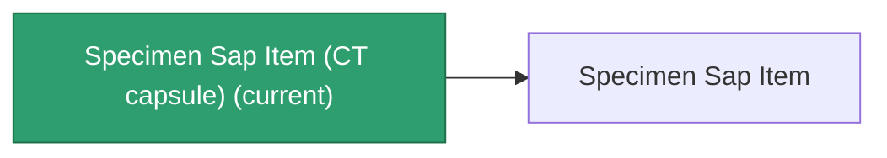

<!-- Generated by tools/generate from the live database (source: entitydefaults definition 5693, aggregatevalues via aggregatefields).
     Do not edit by hand; regenerate instead. -->

# Specimen Sap Item (CT capsule)

|  |  |
|---|---|
| Definition | `def_specimen_sap_item_CT_capsule` |
| Tier | 1 |
| Health | 100 |
| Volume | 0.1 |
| Mass | 0.1 |
| Category | Modules / Enhancements |
| Note | CT Capsule |

_No stats — this item carries no aggregate values._

## Production

The item this capsule carries, and how it is produced (see [Recipes](/content/recipes/) for the full list).

|  |  |
|---|---|
| Research level | – |
| Production cost | Titan ore ×10000, HDT ×40000, Liquizit ×20000, Silgium ×10000, Stermonit ×10000, Imentium ×10000, Helioptris ×10000, Triandlus ×10000, Prismocitae ×10000, Specimen Sap Item Flux ×1 |
| Output | [Specimen Sap Item](/content/items/specimen-sap-item/) |

## Where to buy

Fixed-price vendors that sell this item (see the [Item shop](/content/shop/) for the full catalog).

| Vendor | Qty | TM Coin | ICS Coin | ASI Coin | Credits | UniCoin |
|---|---|---|---|---|---|---|
| New Virginia (zone_TM) | 1 | 10 | 10 | 10 | 500000 | 20 |
| Attalica (zone_ICS) | 1 | 10 | 10 | 10 | 500000 | 20 |
| Attalica outpost | 1 | 10 | 10 | 10 | 500000 | 20 |
| Daoden (zone_ASI) | 1 | 10 | 10 | 10 | 500000 | 20 |
| Daoden outpost | 1 | 10 | 10 | 10 | 500000 | 20 |

[All items](/content/items/)
