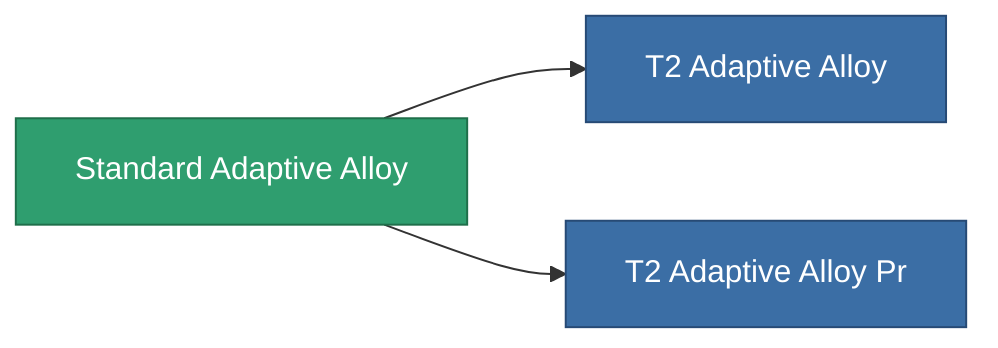

<!-- Generated by tools/generate from the live database (source: entitydefaults definition 8788, aggregatevalues via aggregatefields).
     Do not edit by hand; regenerate instead. -->

# Standard Adaptive Alloy

|  |  |
|---|---|
| Definition | `def_standard_adaptive_alloy` |
| Tier | T1 |
| Health | 100 |
| Volume | 1.5 |
| Mass | 500 |
| Category | Modules / Enhancements |
| Tier line | **Standard Adaptive Alloy** (T1) → [T2 Adaptive Alloy](/content/items/named1-adaptive-alloy/) (T2) → [T3 Adaptive Alloy](/content/items/named2-adaptive-alloy/) (T3) → [T4 Adaptive Alloy](/content/items/named3-adaptive-alloy/) (T4) |

## Stats

| Field | Value |
|---|---|
| adaptive_resist_points | 60 |
| cpu_usage | 38 |
| powergrid_usage | 12 |

<!-- production:generated -->
## Production

**Produced from 9 components, research level 3** — assemble the components to build it (see [Recipes](/content/recipes/) for the full list):

<svg class="prod-card-icon" aria-hidden="true"><use href="#mi-grid"/></svg><a class="prod-card-name" href="/content/items/axicol/">Cryoperine</a>

required: <b>200</b>

<svg class="prod-card-icon" aria-hidden="true"><use href="#mi-grid"/></svg><a class="prod-card-name" href="/content/items/chollonin/">Chollonin</a>

required: <b>25</b>

<svg class="prod-card-icon" aria-hidden="true"><use href="#mi-grid"/></svg><a class="prod-card-name" href="/content/items/isopropentol/">Isopropentol</a>

required: <b>65</b>

<svg class="prod-card-icon" aria-hidden="true"><use href="#mi-grid"/></svg><a class="prod-card-name" href="/content/items/metachropin/">Metachropin</a>

required: <b>65</b>

<svg class="prod-card-icon" aria-hidden="true"><use href="#mi-grid"/></svg><a class="prod-card-name" href="/content/items/plasteosine/">Plasteosine</a>

required: <b>500</b>

<svg class="prod-card-icon" aria-hidden="true"><use href="#mi-grid"/></svg><a class="prod-card-name" href="/content/items/prilumium/">Prilumium</a>

required: <b>25</b>

<svg class="prod-card-icon" aria-hidden="true"><use href="#mi-grid"/></svg><a class="prod-card-name" href="/content/items/statichnol/">Statichnol</a>

required: <b>65</b>

<svg class="prod-card-icon" aria-hidden="true"><use href="#mi-grid"/></svg><a class="prod-card-name" href="/content/items/titanium/">Titanium</a>

required: <b>200</b>

<svg class="prod-card-icon" aria-hidden="true"><use href="#mi-grid"/></svg><a class="prod-card-name" href="/content/items/vitricyl/">Vitricyl</a>

required: <b>25</b>

## Used in production

**Component of 2 items** — everything that uses it in production:

