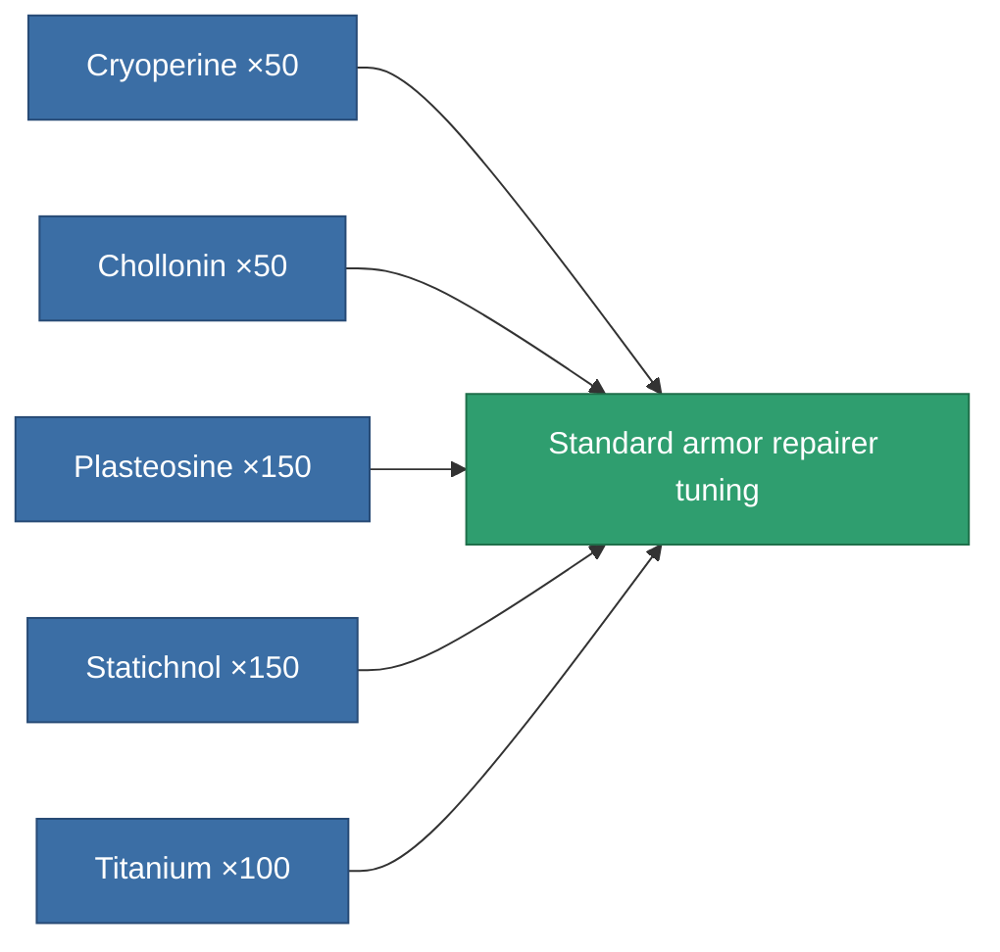
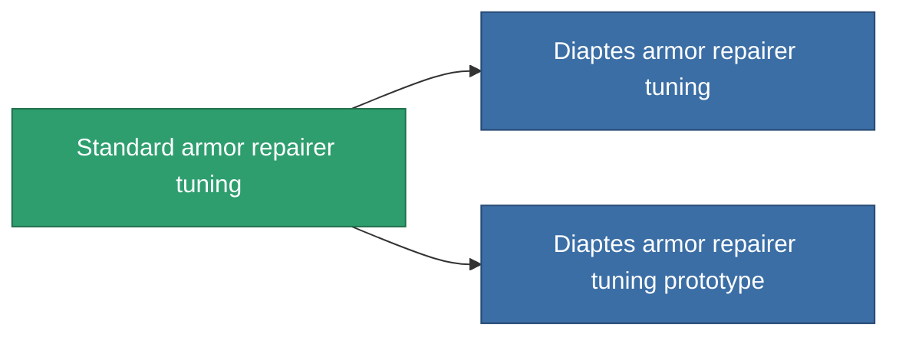

<!-- Generated by tools/generate from the live database (source: entitydefaults definition 1060, aggregatevalues via aggregatefields).
     Do not edit by hand; regenerate instead. -->

# Standard armor repairer tuning

|  |  |
|---|---|
| Definition | `def_standard_armor_repairer_upgrade` |
| Tier | T1 |
| Health | 100 |
| Volume | 0.5 |
| Mass | 300 |
| Category | Modules / Repair |
| Tier line | **Standard armor repairer tuning** (T1) → [Diaptes armor repairer tuning](/content/items/named1-armor-repairer-upgrade/) (T2) → [WPG3000 armor repairer tuning](/content/items/named2-armor-repairer-upgrade/) (T3) → [Apogenion armor repairer tuning](/content/items/named3-armor-repairer-upgrade/) (T4) |

## Stats

| Field | Value |
|---|---|
| armor_repair_amount_modifier | 1.08 |
| armor_repair_cycle_time_modifier | 0.96 |
| cpu_usage | 35 |
| powergrid_usage | 25 |

<!-- production:generated -->
## Production

**Produced from 5 components, research level 3** — assemble the components to build it (see [Recipes](/content/recipes/) for the full list):

## Used in production

**Component of 2 items** — everything that uses it in production:

[All items](/content/items/)
