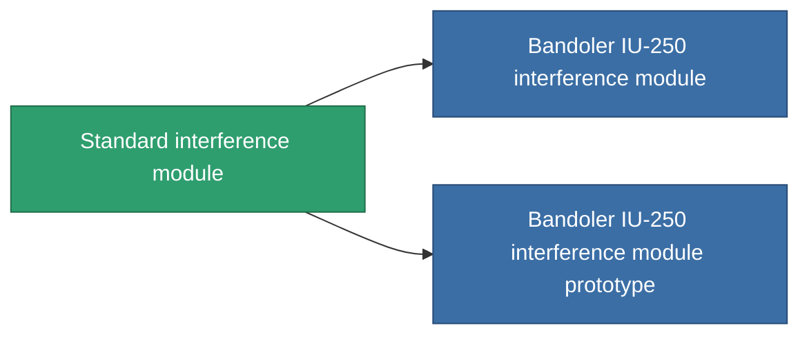

<!-- Generated by tools/generate from the live database (source: entitydefaults definition 2846, aggregatevalues via aggregatefields).
     Do not edit by hand; regenerate instead. -->

# Standard interference module

|  |  |
|---|---|
| Definition | `def_standard_blob_emission_modulator` |
| Tier | T1 |
| Health | 100 |
| Volume | 0.5 |
| Mass | 150 |
| Category | Modules / Enhancements |
| Tier line | **Standard interference module** (T1) → [Bandoler IU-250 interference module](/content/items/named1-blob-emission-modulator/) (T2) → [Bandoler IV-500 interference module](/content/items/named2-blob-emission-modulator/) (T3) → [Omini interference module](/content/items/named3-blob-emission-modulator/) (T4) |

## Stats

| Field | Value |
|---|---|
| blob_emission_modifier | 1 |
| blob_emission_radius_modifier | 1 |
| core_usage | 50 |
| cpu_usage | 85 |
| cycle_time | 5k |
| optimal_range | 30 |
| powergrid_usage | 150 |

<!-- production:generated -->
## Production

**Produced from 3 components, research level 5** — assemble the components to build it (see [Recipes](/content/recipes/) for the full list):

<svg class="prod-card-icon" aria-hidden="true"><use href="#mi-grid"/></svg><a class="prod-card-name" href="/content/items/axicol/">Cryoperine</a>

required: <b>250</b>

<svg class="prod-card-icon" aria-hidden="true"><use href="#mi-grid"/></svg><a class="prod-card-name" href="/content/items/axicoline/">Axicoline</a>

required: <b>100</b>

<svg class="prod-card-icon" aria-hidden="true"><use href="#mi-grid"/></svg><a class="prod-card-name" href="/content/items/titanium/">Titanium</a>

required: <b>50</b>

## Used in production

**Component of 2 items** — everything that uses it in production:

