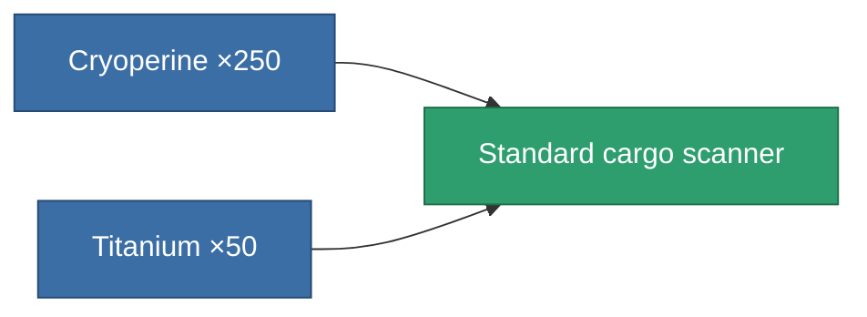
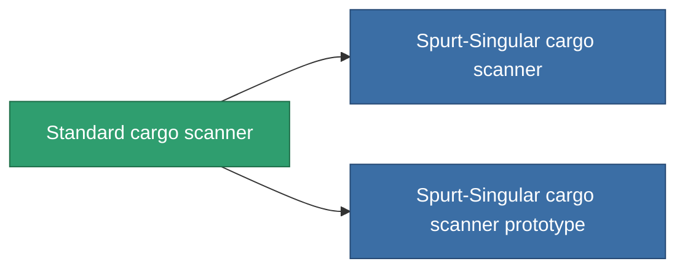

<!-- Generated by tools/generate from the live database (source: entitydefaults definition 45, aggregatevalues via aggregatefields).
     Do not edit by hand; regenerate instead. -->

# Standard cargo scanner

|  |  |
|---|---|
| Definition | `def_standard_cargo_scanner` |
| Tier | T1 |
| Health | 100 |
| Volume | 0.5 |
| Mass | 100 |
| Category | Modules / Sensors & scanning |
| Tier line | **Standard cargo scanner** (T1) → [Spurt-Singular cargo scanner](/content/items/named1-cargo-scanner/) (T2) → [Nomothetor cargo scanner](/content/items/named2-cargo-scanner/) (T3) → [Visioner cargo scanner](/content/items/named3-cargo-scanner/) (T4) |

## Stats

| Field | Value |
|---|---|
| core_usage | 50 |
| cpu_usage | 20 |
| cycle_time | 10k |
| falloff | 20 |
| optimal_range | 15 |
| powergrid_usage | 10 |

<!-- production:generated -->
## Production

**Produced from 2 components, research level 3** — assemble the components to build it (see [Recipes](/content/recipes/) for the full list):

## Used in production

**Component of 2 items** — everything that uses it in production:

[All items](/content/items/)
