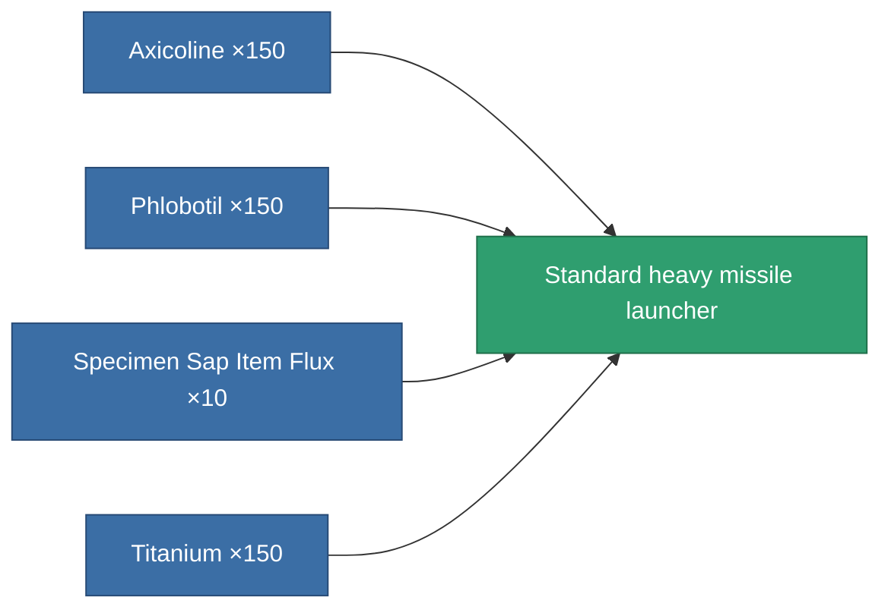
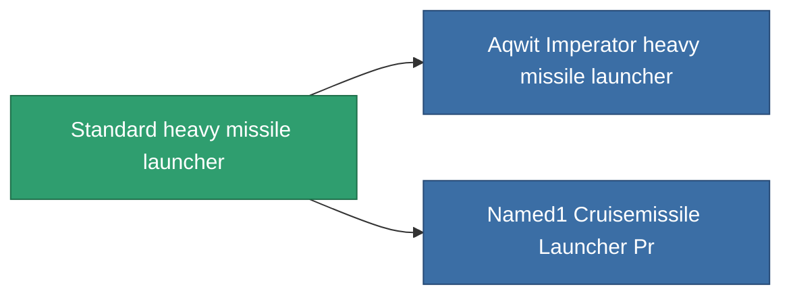

<!-- Generated by tools/generate from the live database (source: entitydefaults definition 65, aggregatevalues via aggregatefields).
     Do not edit by hand; regenerate instead. -->

# Standard heavy missile launcher

|  |  |
|---|---|
| Definition | `def_standard_cruisemissile_launcher` |
| Tier | 1 |
| Health | 100 |
| Volume | 1.5 |
| Mass | 1000 |
| Category | Modules / Weapons |

## Stats

| Field | Value |
|---|---|
| accuracy | 1 |
| core_usage | 15 |
| cpu_usage | 100 |
| cycle_time | 14k |
| damage_modifier | 1.3 |
| powergrid_usage | 225 |

<!-- production:generated -->
## Production

**Produced from 4 components** — assemble the components to build it (see [Recipes](/content/recipes/) for the full list):

## Used in production

**Component of 2 items** — everything that uses it in production:

[All items](/content/items/)
