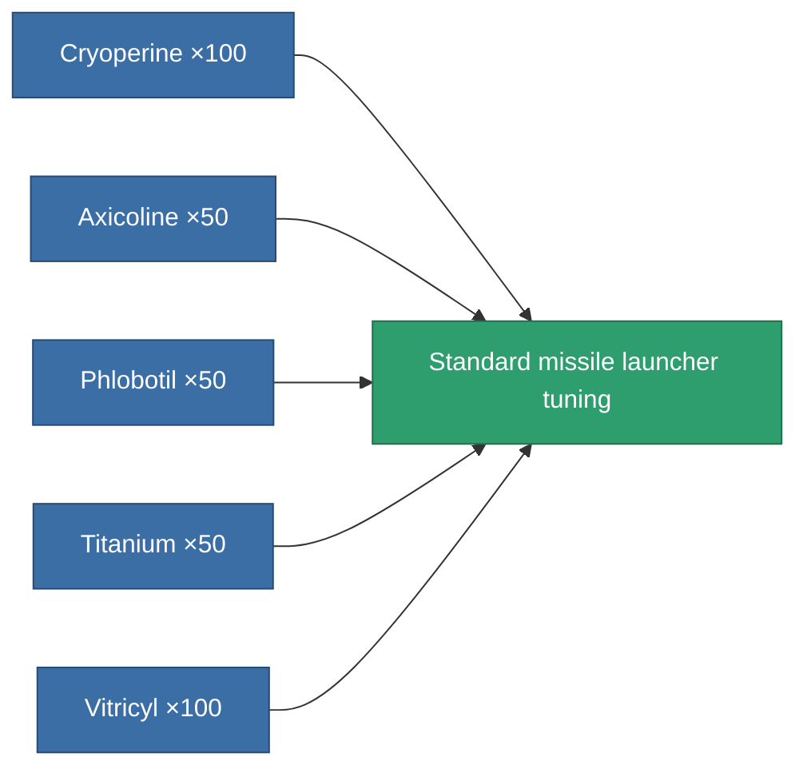
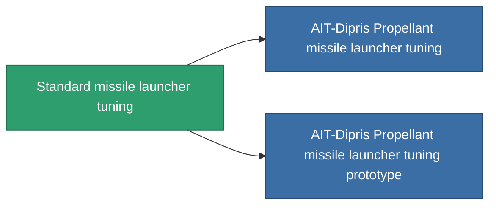

<!-- Generated by tools/generate from the live database (source: entitydefaults definition 910, aggregatevalues via aggregatefields).
     Do not edit by hand; regenerate instead. -->

# Standard missile launcher tuning

|  |  |
|---|---|
| Definition | `def_standard_damage_mod_missile` |
| Tier | T1 |
| Health | 100 |
| Volume | 0.5 |
| Mass | 100 |
| Category | Modules / Enhancements |
| Tier line | **Standard missile launcher tuning** (T1) → [AIT-Dipris Propellant missile launcher tuning](/content/items/named1-damage-mod-missile/) (T2) → [Pelistec-FBP-II. missile launcher tuning](/content/items/named2-damage-mod-missile/) (T3) → [Dozer-IMT missile launcher tuning](/content/items/named3-damage-mod-missile/) (T4) |

## Stats

| Field | Value |
|---|---|
| cpu_usage | 25 |
| damage_missile_modifier | 0.15 |
| powergrid_usage | 5 |

<!-- production:generated -->
## Production

**Produced from 5 components, research level 3** — assemble the components to build it (see [Recipes](/content/recipes/) for the full list):

## Used in production

**Component of 2 items** — everything that uses it in production:

[All items](/content/items/)
