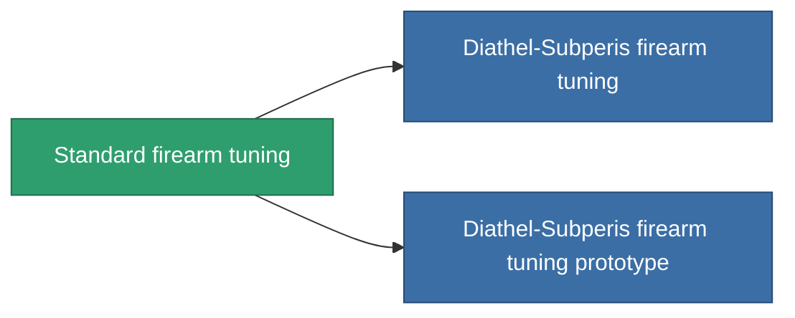

<!-- Generated by tools/generate from the live database (source: entitydefaults definition 912, aggregatevalues via aggregatefields).
     Do not edit by hand; regenerate instead. -->

# Standard firearm tuning

|  |  |
|---|---|
| Definition | `def_standard_damage_mod_projectile` |
| Tier | T1 |
| Health | 100 |
| Volume | 0.5 |
| Mass | 100 |
| Category | Modules / Enhancements |
| Tier line | **Standard firearm tuning** (T1) → [Diathel-Subperis firearm tuning](/content/items/named1-damage-mod-projectile/) (T2) → [Plasmidwad-9000 firearm tuning](/content/items/named2-damage-mod-projectile/) (T3) → [DVT-800g firearm tuning](/content/items/named3-damage-mod-projectile/) (T4) |

## Stats

| Field | Value |
|---|---|
| cpu_usage | 15 |
| damage_projectile_modifier | 0.15 |
| powergrid_usage | 5 |

<!-- production:generated -->
## Production

**Produced from 3 components, research level 3** — assemble the components to build it (see [Recipes](/content/recipes/) for the full list):

<svg class="prod-card-icon" aria-hidden="true"><use href="#mi-grid"/></svg><a class="prod-card-name" href="/content/items/axicol/">Cryoperine</a>

required: <b>200</b>

<svg class="prod-card-icon" aria-hidden="true"><use href="#mi-grid"/></svg><a class="prod-card-name" href="/content/items/axicoline/">Axicoline</a>

required: <b>100</b>

<svg class="prod-card-icon" aria-hidden="true"><use href="#mi-grid"/></svg><a class="prod-card-name" href="/content/items/titanium/">Titanium</a>

required: <b>100</b>

## Used in production

**Component of 2 items** — everything that uses it in production:

