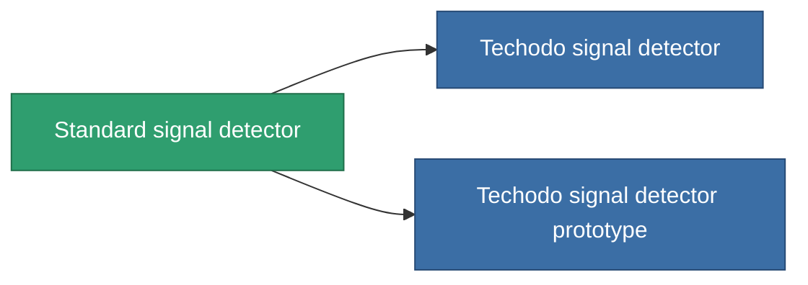

<!-- Generated by tools/generate from the live database (source: entitydefaults definition 2896, aggregatevalues via aggregatefields).
     Do not edit by hand; regenerate instead. -->

# Standard signal detector

|  |  |
|---|---|
| Definition | `def_standard_detection_modul` |
| Tier | 1 |
| Health | 100 |
| Volume | 0.5 |
| Mass | 250 |
| Category | Modules / Enhancements |

## Stats

| Field | Value |
|---|---|
| core_usage | 180 |
| cpu_usage | 85 |
| cycle_time | 25k |
| effect_detection_strength_modifier | 20 |
| effect_stealth_strength_modifier | -20 |
| powergrid_usage | 5 |

<!-- production:generated -->
## Production

**Component of 2 items** — everything that uses it in production:

[All items](/content/items/)
