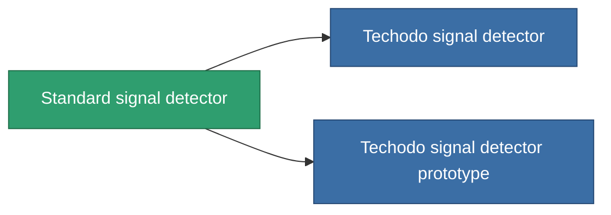

<!-- Generated by tools/generate from the live database (source: entitydefaults definition 2896, aggregatevalues via aggregatefields).
     Do not edit by hand; regenerate instead. -->

# Standard signal detector

|  |  |
|---|---|
| Definition | `def_standard_detection_modul` |
| Tier | T1 |
| Health | 100 |
| Volume | 0.5 |
| Mass | 250 |
| Category | Modules / Enhancements |
| Tier line | **Standard signal detector** (T1) → [Techodo signal detector](/content/items/named1-detection-modul/) (T2) → [MX-1 Dogon signal detector](/content/items/named2-detection-modul/) (T3) → ['Rogue' signal detector](/content/items/named3-detection-modul/) (T4) |

## Stats

| Field | Value |
|---|---|
| core_usage | 180 |
| cpu_usage | 85 |
| cycle_time | 25k |
| effect_detection_strength_modifier | 20 |
| effect_stealth_strength_modifier | -20 |
| powergrid_usage | 5 |

<!-- production:generated -->
## Production

**Produced from 3 components, research level 6** — assemble the components to build it (see [Recipes](/content/recipes/) for the full list):

<svg class="prod-card-icon" aria-hidden="true"><use href="#mi-grid"/></svg><a class="prod-card-name" href="/content/items/axicol/">Cryoperine</a>

required: <b>450</b>

<svg class="prod-card-icon" aria-hidden="true"><use href="#mi-grid"/></svg><a class="prod-card-name" href="/content/items/plasteosine/">Plasteosine</a>

required: <b>50</b>

<svg class="prod-card-icon" aria-hidden="true"><use href="#mi-grid"/></svg><a class="prod-card-name" href="/content/items/titanium/">Titanium</a>

required: <b>200</b>

## Used in production

**Component of 2 items** — everything that uses it in production:

