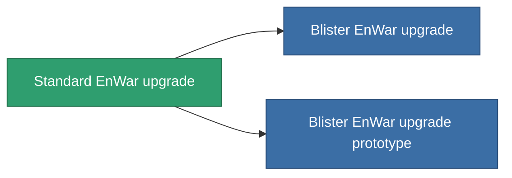

<!-- Generated by tools/generate from the live database (source: entitydefaults definition 4577, aggregatevalues via aggregatefields).
     Do not edit by hand; regenerate instead. -->

# Standard EnWar upgrade

|  |  |
|---|---|
| Definition | `def_standard_energy_warfare_upgrade` |
| Tier | 1 |
| Health | 100 |
| Volume | 1 |
| Mass | 250 |
| Category | Modules / Enhancements |

## Stats

| Field | Value |
|---|---|
| core_usage_energy_neutralizers_modifier | 1.1 |
| cpu_usage | 25 |
| energy_neutralized_amount_modifier | 1.2 |
| energy_vampired_amount_modifier | 1.1 |
| powergrid_usage | 45 |

<!-- production:generated -->
## Production

**Component of 2 items** — everything that uses it in production:

[All items](/content/items/)
