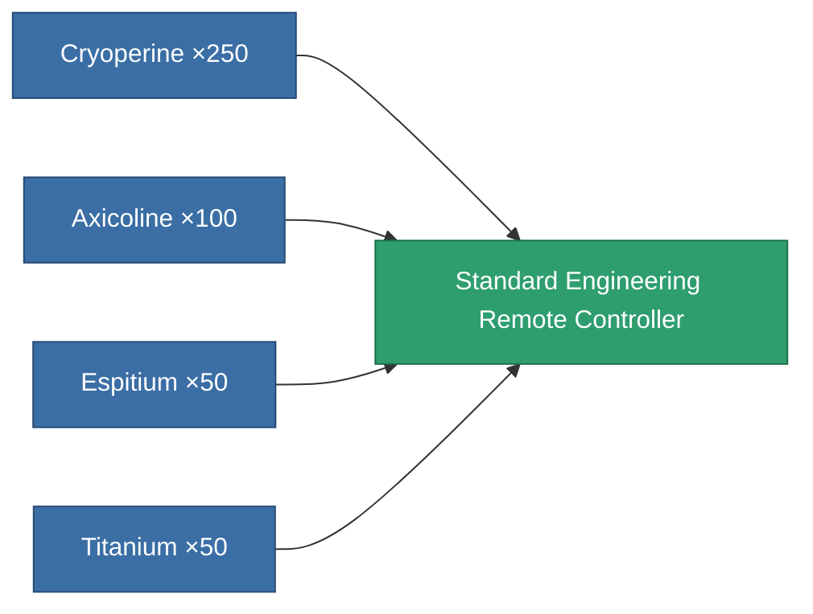
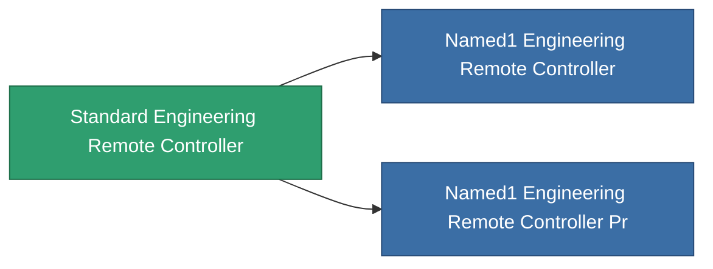

<!-- Generated by tools/generate from the live database (source: entitydefaults definition 9009, aggregatevalues via aggregatefields).
     Do not edit by hand; regenerate instead. -->

# Standard Engineering Remote Controller

|  |  |
|---|---|
| Definition | `def_standard_engineering_remote_controller` |
| Tier | T1 |
| Health | 100 |
| Volume | 1 |
| Mass | 1 |
| Category | Modules / Remote control |
| Tier line | **Standard Engineering Remote Controller** (T1) → [Named1 Engineering Remote Controller](/content/items/named1-engineering-remote-controller/) (T2) → [Named2 Engineering Remote Controller](/content/items/named2-engineering-remote-controller/) (T3) → [Named3 Engineering Remote Controller](/content/items/named3-engineering-remote-controller/) (T4) |

## Stats

| Field | Value |
|---|---|
| core_usage | 150 |
| cpu_usage | 85 |
| cycle_time | 10k |
| powergrid_usage | 75 |
| remote_control_bandwidth_max | 0 |
| remote_control_lifetime | 300k |
| remote_control_operational_range | 30 |
| turret_amplification_accuracy_modifier | 1 |
| turret_amplification_armor_max_modifier | 1 |
| turret_amplification_core_max_modifier | 1 |
| turret_amplification_core_recharge_time_modifier | 1 |
| turret_amplification_cycle_time_modifier | 1 |
| turret_amplification_damage_modifier | 1 |
| turret_amplification_locking_time_modifier | 1 |
| turret_amplification_long_range_modifier | 1 |
| turret_amplification_reactor_radiation_modifier | 1 |

<!-- production:generated -->
## Production

**Produced from 4 components, research level 5** — assemble the components to build it (see [Recipes](/content/recipes/) for the full list):

## Used in production

**Component of 2 items** — everything that uses it in production:

[All items](/content/items/)
