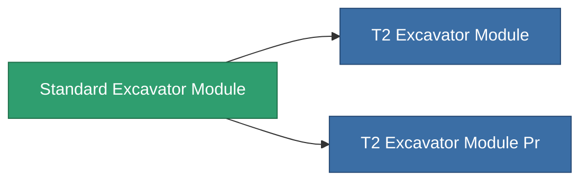

<!-- Generated by tools/generate from the live database (source: entitydefaults definition 8819, aggregatevalues via aggregatefields).
     Do not edit by hand; regenerate instead. -->

# Standard Excavator Module

|  |  |
|---|---|
| Definition | `def_standard_excavator_module` |
| Tier | T1 |
| Health | 100 |
| Volume | 2.5 |
| Mass | 2000 |
| Category | Modules / Harvesting |
| Tier line | **Standard Excavator Module** (T1) → [T2 Excavator Module](/content/items/named1-excavator-module/) (T2) → [T3 Excavator Module](/content/items/named2-excavator-module/) (T3) → [T4 Excavator Module](/content/items/named3-excavator-module/) (T4) |

## Stats

| Field | Value |
|---|---|
| core_usage | 165 |
| cpu_usage | 450 |
| cycle_time | 180k |
| effect_excavator_harvesting_amount_modifier | 1.3 |
| effect_excavator_mining_amount_modifier | 1.3 |
| effect_excavator_stealth_strength_modifier | -30 |
| powergrid_usage | 1.35k |

<!-- production:generated -->
## Production

**Produced from 2 components, research level 5** — assemble the components to build it (see [Recipes](/content/recipes/) for the full list):

<svg class="prod-card-icon" aria-hidden="true"><use href="#mi-grid"/></svg><a class="prod-card-name" href="/content/items/axicol/">Cryoperine</a>

required: <b>1.6k</b>

<svg class="prod-card-icon" aria-hidden="true"><use href="#mi-grid"/></svg><a class="prod-card-name" href="/content/items/titanium/">Titanium</a>

required: <b>2.4k</b>

## Used in production

**Component of 2 items** — everything that uses it in production:

