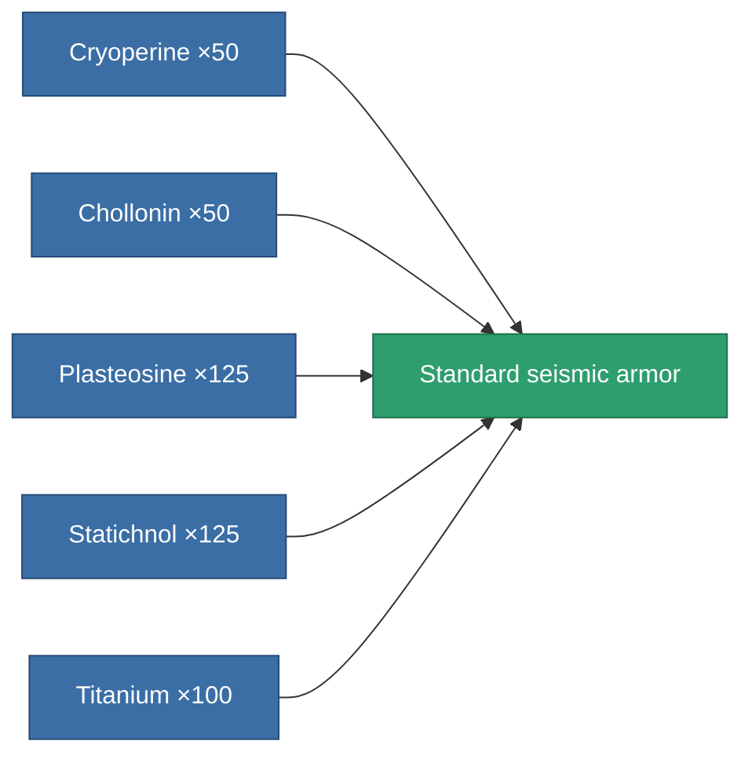
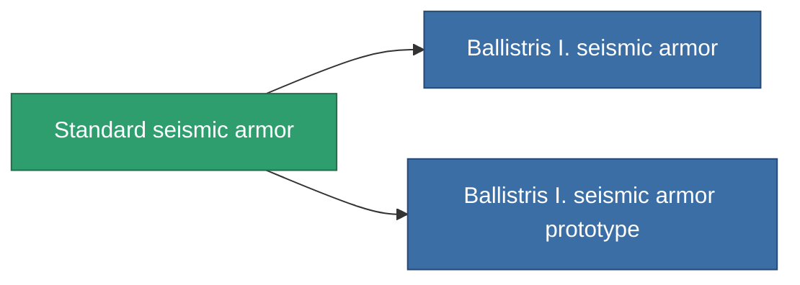

<!-- Generated by tools/generate from the live database (source: entitydefaults definition 27, aggregatevalues via aggregatefields).
     Do not edit by hand; regenerate instead. -->

# Standard seismic armor

|  |  |
|---|---|
| Definition | `def_standard_exp_armor_hardener` |
| Tier | T1 |
| Health | 100 |
| Volume | 1 |
| Mass | 100 |
| Category | Modules / Armor |
| Tier line | **Standard seismic armor** (T1) → [Ballistris I. seismic armor](/content/items/named1-exp-armor-hardener/) (T2) → [Formantel-DVU seismic armor](/content/items/named2-exp-armor-hardener/) (T3) → [Sheltor seismic armor](/content/items/named3-exp-armor-hardener/) (T4) |

## Stats

| Field | Value |
|---|---|
| core_usage | 13 |
| cpu_usage | 25 |
| cycle_time | 10k |
| effect_resist_explosive | 100 |
| powergrid_usage | 5 |
| resist_explosive | 25 |

<!-- production:generated -->
## Production

**Produced from 5 components, research level 3** — assemble the components to build it (see [Recipes](/content/recipes/) for the full list):

## Used in production

**Component of 2 items** — everything that uses it in production:

[All items](/content/items/)
