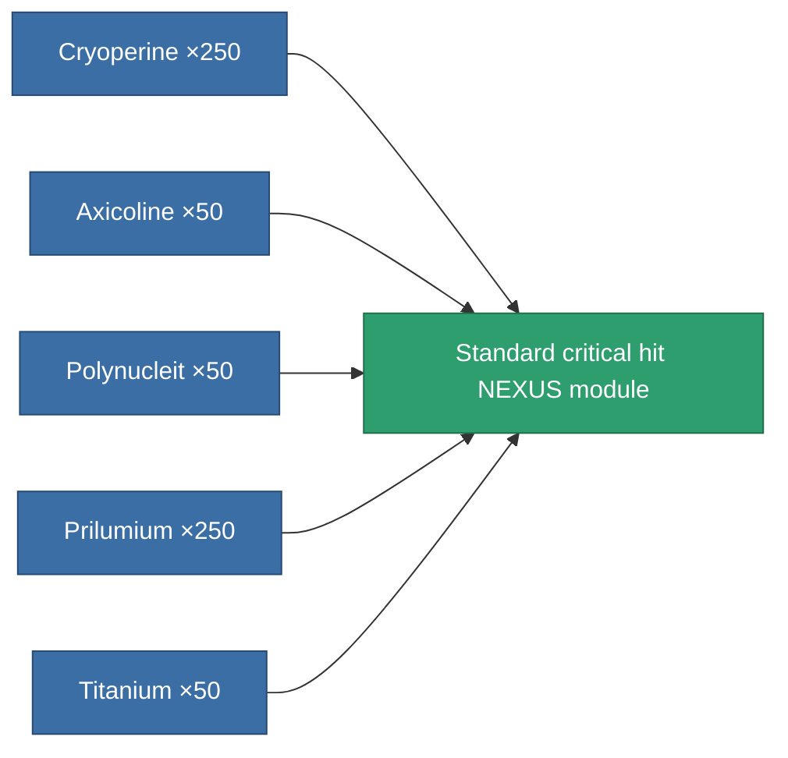
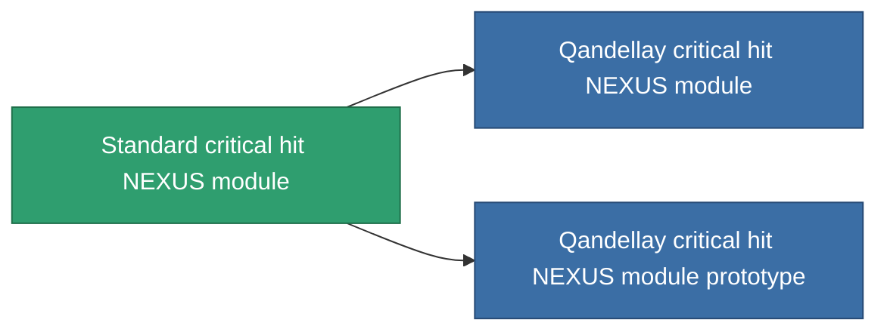

<!-- Generated by tools/generate from the live database (source: entitydefaults definition 2555, aggregatevalues via aggregatefields).
     Do not edit by hand; regenerate instead. -->

# Standard critical hit NEXUS module

|  |  |
|---|---|
| Definition | `def_standard_gang_assist_precision_firing_module` |
| Tier | T1 |
| Health | 100 |
| Volume | 0.2 |
| Mass | 50 |
| Category | Modules / Enhancements |
| Tier line | **Standard critical hit NEXUS module** (T1) → [Qandellay critical hit NEXUS module](/content/items/named1-gang-assist-precision-firing-module/) (T2) → [E-scope critical hit NEXUS module](/content/items/named2-gang-assist-precision-firing-module/) (T3) → [ZTW critical hit NEXUS module](/content/items/named3-gang-assist-precision-firing-module/) (T4) |
| Note | crit_chancet novel |

## Stats

| Field | Value |
|---|---|
| core_usage | 35 |
| cpu_usage | 85 |
| cycle_time | 10k |
| default_effect_range | 100 |
| effect_critical_hit_chance_modifier | 0.02 |
| powergrid_usage | 35 |

<!-- production:generated -->
## Production

**Produced from 5 components, research level 4** — assemble the components to build it (see [Recipes](/content/recipes/) for the full list):

## Used in production

**Component of 2 items** — everything that uses it in production:

[All items](/content/items/)
