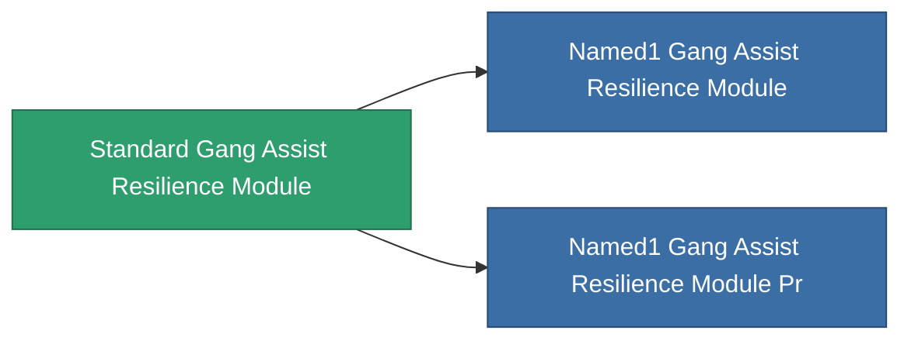

<!-- Generated by tools/generate from the live database (source: entitydefaults definition 2560, aggregatevalues via aggregatefields).
     Do not edit by hand; regenerate instead. -->

# Standard Gang Assist Resilience Module

|  |  |
|---|---|
| Definition | `def_standard_gang_assist_resilience_module` |
| Tier | T1 |
| Health | 100 |
| Volume | 0.2 |
| Mass | 50 |
| Category | Modules / Enhancements |
| Tier line | **Standard Gang Assist Resilience Module** (T1) → [Named1 Gang Assist Resilience Module](/content/items/named1-gang-assist-resilience-module/) (T2) → [Named2 Gang Assist Resilience Module](/content/items/named2-gang-assist-resilience-module/) (T3) → [Named3 Gang Assist Resilience Module](/content/items/named3-gang-assist-resilience-module/) (T4) |
| Note | shield absorbtion ratiot javit |

## Stats

| Field | Value |
|---|---|
| core_usage | 35 |
| cpu_usage | 85 |
| cycle_time | 10k |
| default_effect_range | 100 |
| effect_devastate_resilience_modifier | 1.02 |
| powergrid_usage | 35 |

<!-- production:generated -->
## Used in production

**Component of 2 items** — everything that uses it in production:

[All items](/content/items/)
