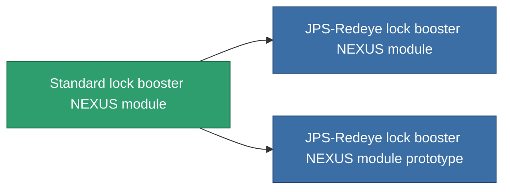

<!-- Generated by tools/generate from the live database (source: entitydefaults definition 2551, aggregatevalues via aggregatefields).
     Do not edit by hand; regenerate instead. -->

# Standard lock booster NEXUS module

|  |  |
|---|---|
| Definition | `def_standard_gang_assist_shared_dataprocessing_module` |
| Tier | T1 |
| Health | 100 |
| Volume | 0.2 |
| Mass | 50 |
| Category | Modules / Enhancements |
| Tier line | **Standard lock booster NEXUS module** (T1) → [JPS-Redeye lock booster NEXUS module](/content/items/named1-gang-assist-shared-dataprocessing-module/) (T2) → [Tersung lock booster NEXUS module](/content/items/named2-gang-assist-shared-dataprocessing-module/) (T3) → [JPS-Greeneye lock booster NEXUS module](/content/items/named3-gang-assist-shared-dataprocessing-module/) (T4) |
| Note | locking timet csokkent |

## Stats

| Field | Value |
|---|---|
| core_usage | 35 |
| cpu_usage | 85 |
| cycle_time | 10k |
| default_effect_range | 100 |
| effect_locking_time_modifier | 0.98 |
| powergrid_usage | 35 |

<!-- production:generated -->
## Production

**Produced from 5 components, research level 4** — assemble the components to build it (see [Recipes](/content/recipes/) for the full list):

<svg class="prod-card-icon" aria-hidden="true"><use href="#mi-grid"/></svg><a class="prod-card-name" href="/content/items/axicol/">Cryoperine</a>

required: <b>250</b>

<svg class="prod-card-icon" aria-hidden="true"><use href="#mi-grid"/></svg><a class="prod-card-name" href="/content/items/axicoline/">Axicoline</a>

required: <b>50</b>

<svg class="prod-card-icon" aria-hidden="true"><use href="#mi-grid"/></svg><a class="prod-card-name" href="/content/items/phlobotil/">Phlobotil</a>

required: <b>50</b>

<svg class="prod-card-icon" aria-hidden="true"><use href="#mi-grid"/></svg><a class="prod-card-name" href="/content/items/titanium/">Titanium</a>

required: <b>50</b>

<svg class="prod-card-icon" aria-hidden="true"><use href="#mi-grid"/></svg><a class="prod-card-name" href="/content/items/vitricyl/">Vitricyl</a>

required: <b>250</b>

## Used in production

**Component of 2 items** — everything that uses it in production:

