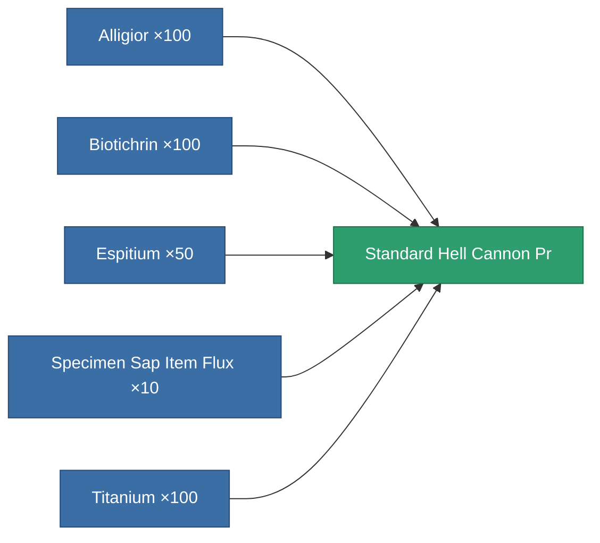

<!-- Generated by tools/generate from the live database (source: entitydefaults definition 8934, aggregatevalues via aggregatefields).
     Do not edit by hand; regenerate instead. -->

# Standard Hell Cannon Pr

|  |  |
|---|---|
| Definition | `def_standard_hell_cannon_pr` |
| Tier | 1 |
| Health | 100 |
| Volume | 1.8 |
| Mass | 1045 |
| Category | Modules / Weapons |

## Stats

| Field | Value |
|---|---|
| accuracy | 44 |
| core_usage | 1.8 |
| cpu_usage | 52.25 |
| cycle_time | 8k |
| damage_modifier | 2.2 |
| falloff | 20 |
| optimal_range | 15 |
| powergrid_usage | 185.25 |

<!-- production:generated -->
## Production

**Produced from 5 components, research level 5** — assemble the components to build it (see [Recipes](/content/recipes/) for the full list):

[All items](/content/items/)
