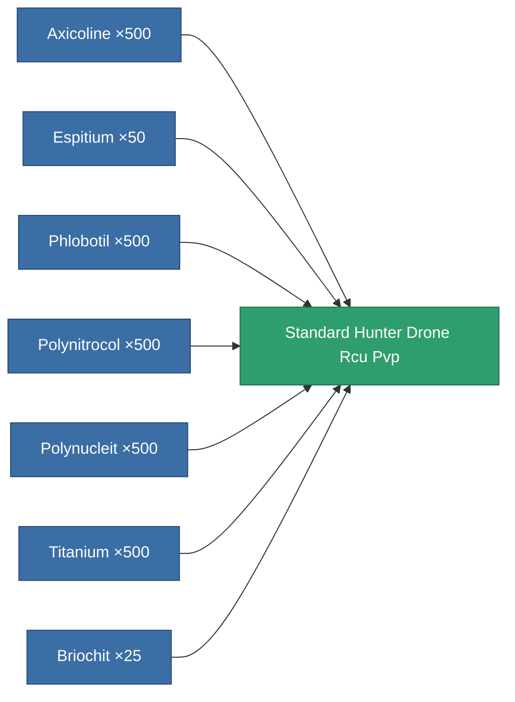

<!-- Generated by tools/generate from the live database (source: entitydefaults definition 8979, aggregatevalues via aggregatefields).
     Do not edit by hand; regenerate instead. -->

# Standard Hunter Drone Rcu Pvp

|  |  |
|---|---|
| Definition | `def_standard_hunter_drone_rcu_pvp` |
| Tier | T1 |
| Health | 100 |
| Volume | 1 |
| Mass | 50 |
| Category | Special & other / Miscellaneous |
| Note | Hunter drone RCU charge (PvP). |

## Stats

| Field | Value |
|---|---|
| remote_control_bandwidth_usage | 1 |

<!-- production:generated -->
## Production

**Produced from 7 components, research level 5** — assemble the components to build it (see [Recipes](/content/recipes/) for the full list):

[All items](/content/items/)
