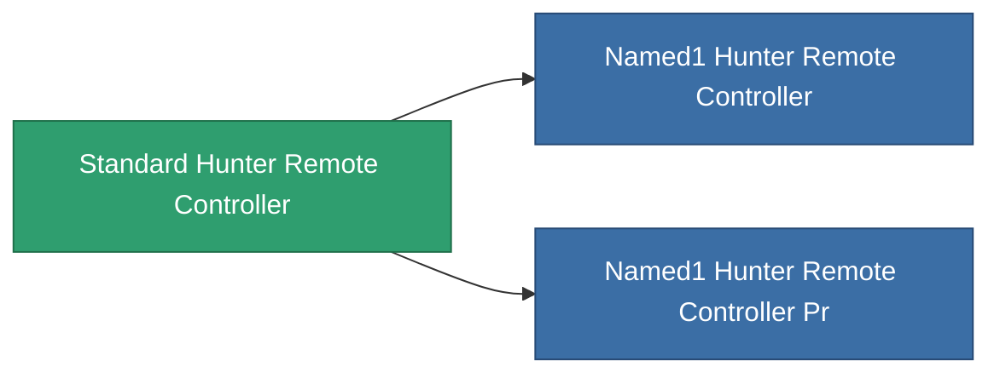

<!-- Generated by tools/generate from the live database (source: entitydefaults definition 8977, aggregatevalues via aggregatefields).
     Do not edit by hand; regenerate instead. -->

# Standard Hunter Remote Controller

|  |  |
|---|---|
| Definition | `def_standard_hunter_remote_controller` |
| Tier | 1 |
| Health | 100 |
| Volume | 100 |
| Mass | 500 |
| Category | Modules / Remote control |
| Note | Deploys an autonomous hunter drone -- PvE ammo hunts Niani NPCs, PvP ammo hunts hostile-standing players. |

## Stats

| Field | Value |
|---|---|
| core_usage | 150 |
| cpu_usage | 250 |
| cycle_time | 5k |
| detection_range | 100 |
| powergrid_usage | 65 |
| remote_control_bandwidth_max | 1 |
| remote_control_lifetime | 1.8M |
| remote_control_operational_range | 150 |

<!-- production:generated -->
## Production

**Component of 2 items** — everything that uses it in production:

[All items](/content/items/)
