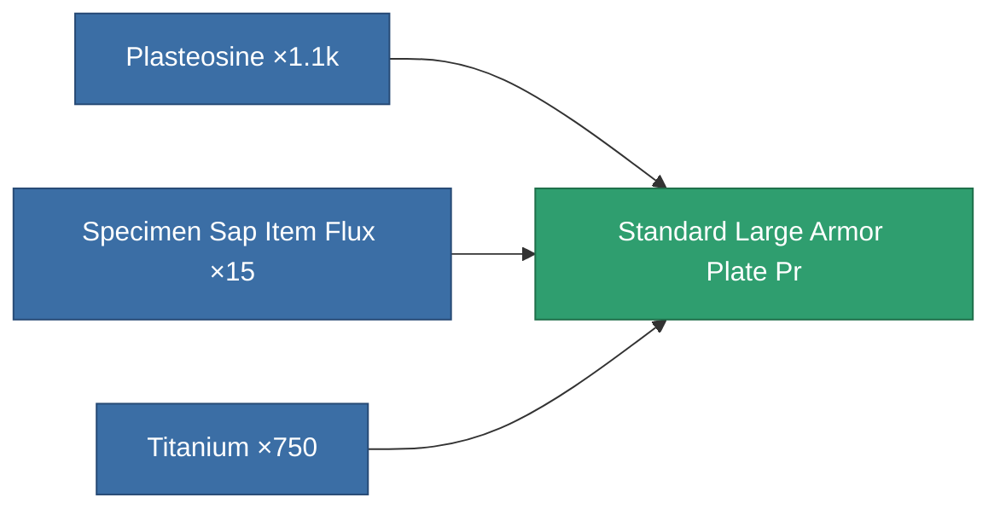

<!-- Generated by tools/generate from the live database (source: entitydefaults definition 5762, aggregatevalues via aggregatefields).
     Do not edit by hand; regenerate instead. -->

# Standard Large Armor Plate Pr

|  |  |
|---|---|
| Definition | `def_standard_large_armor_plate_pr` |
| Tier | – |
| Health | 100 |
| Volume | 4 |
| Mass | 9000 |
| Category | Modules / Armor |
| Tier line | [Standard large armor plate](/content/items/standard-large-armor-plate/) (T1) → **Standard Large Armor Plate Pr** () → [Vorbol p113 heavy armor plate](/content/items/named1-large-armor-plate/) (T2) → [Invigor III. heavy armor plate](/content/items/named2-large-armor-plate/) (T3) → [Halc heavy armor plate](/content/items/named3-large-armor-plate/) (T4) |
| Note | large module |

## Stats

| Field | Value |
|---|---|
| armor_max | 4.05k |
| cpu_usage | 60 |
| massiveness | 0.144 |
| powergrid_usage | 1.05k |
| signature_radius | 3 |

<!-- production:generated -->
## Production

**Produced from 3 components, research level 4** — assemble the components to build it (see [Recipes](/content/recipes/) for the full list):

[All items](/content/items/)
