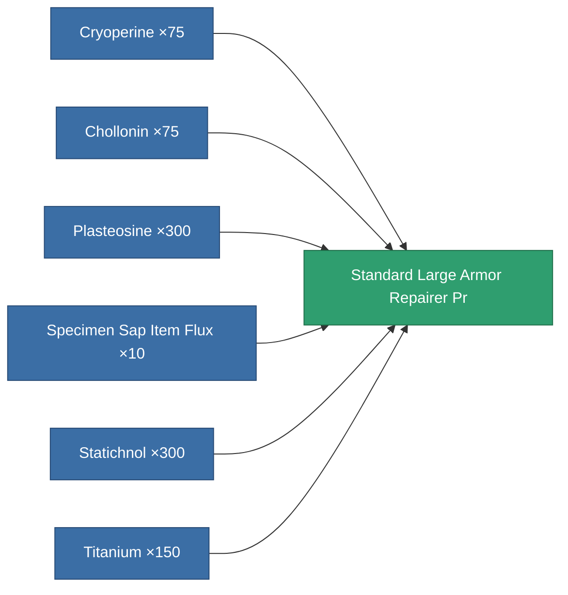

<!-- Generated by tools/generate from the live database (source: entitydefaults definition 5766, aggregatevalues via aggregatefields).
     Do not edit by hand; regenerate instead. -->

# Standard Large Armor Repairer Pr

|  |  |
|---|---|
| Definition | `def_standard_large_armor_repairer_pr` |
| Tier | – |
| Health | 100 |
| Volume | 3 |
| Mass | 1500 |
| Category | Modules / Repair |
| Tier line | [Standard large armor repairer](/content/items/standard-large-armor-repairer/) (T1) → **Standard Large Armor Repairer Pr** () → [Stesodenn large armor repairer](/content/items/named1-large-armor-repairer/) (T2) → [FO-330 'Reconstructor' large armor repairer](/content/items/named2-large-armor-repairer/) (T3) → [Pandegris large armor repairer](/content/items/named3-large-armor-repairer/) (T4) |
| Note | large module |

## Stats

| Field | Value |
|---|---|
| armor_repair_amount | 360 |
| core_usage | 495 |
| cpu_usage | 400 |
| cycle_time | 15k |
| powergrid_usage | 1k |

<!-- production:generated -->
## Production

**Produced from 6 components, research level 5** — assemble the components to build it (see [Recipes](/content/recipes/) for the full list):

[All items](/content/items/)
