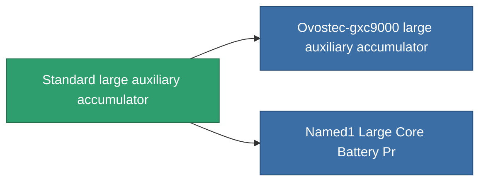

<!-- Generated by tools/generate from the live database (source: entitydefaults definition 647, aggregatevalues via aggregatefields).
     Do not edit by hand; regenerate instead. -->

# Standard large auxiliary accumulator

|  |  |
|---|---|
| Definition | `def_standard_large_core_battery` |
| Tier | 1 |
| Health | 100 |
| Volume | 3 |
| Mass | 3000 |
| Category | Modules / Power |

## Stats

| Field | Value |
|---|---|
| core_max | 1.125k |
| cpu_usage | 400 |
| powergrid_usage | 840 |

<!-- production:generated -->
## Production

**Component of 2 items** — everything that uses it in production:

[All items](/content/items/)
