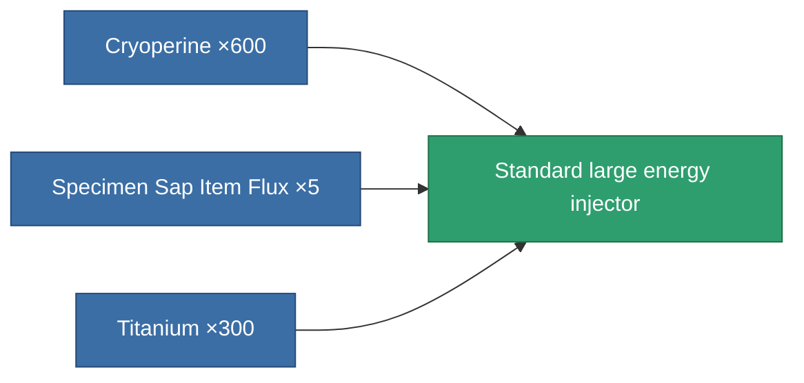
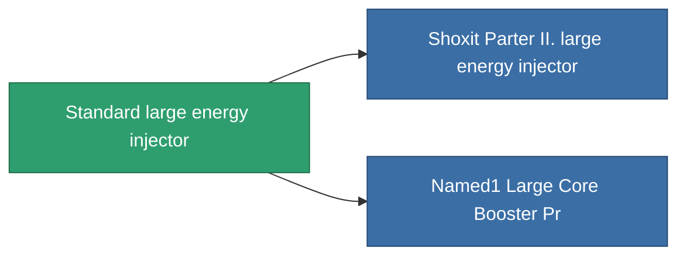

<!-- Generated by tools/generate from the live database (source: entitydefaults definition 650, aggregatevalues via aggregatefields).
     Do not edit by hand; regenerate instead. -->

# Standard large energy injector

|  |  |
|---|---|
| Definition | `def_standard_large_core_booster` |
| Tier | T1 |
| Health | 100 |
| Volume | 2 |
| Mass | 1600 |
| Category | Modules / Enhancements |
| Tier line | **Standard large energy injector** (T1) → [Shoxit Parter II. large energy injector](/content/items/named1-large-core-booster/) (T2) → [CC90-Tensio large energy injector](/content/items/named2-large-core-booster/) (T3) → [Rymur DTTO large energy injector](/content/items/named3-large-core-booster/) (T4) |

## Stats

| Field | Value |
|---|---|
| core_usage | 0 |
| cpu_usage | 375 |
| cycle_time | 6.05k |
| powergrid_usage | 1.25k |

<!-- production:generated -->
## Production

**Produced from 3 components** — assemble the components to build it (see [Recipes](/content/recipes/) for the full list):

## Used in production

**Component of 2 items** — everything that uses it in production:

[All items](/content/items/)
