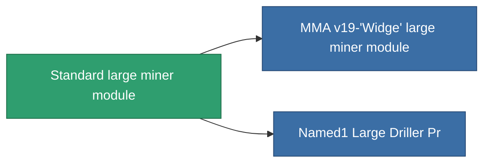

<!-- Generated by tools/generate from the live database (source: entitydefaults definition 8678, aggregatevalues via aggregatefields).
     Do not edit by hand; regenerate instead. -->

# Standard large miner module

|  |  |
|---|---|
| Definition | `def_standard_large_driller` |
| Tier | 1 |
| Health | 100 |
| Volume | 2.5 |
| Mass | 2000 |
| Category | Modules / Enhancements |

## Stats

| Field | Value |
|---|---|
| core_usage | 165 |
| cpu_usage | 450 |
| cycle_time | 12k |
| powergrid_usage | 1.35k |

<!-- production:generated -->
## Production

**Component of 2 items** — everything that uses it in production:

[All items](/content/items/)
