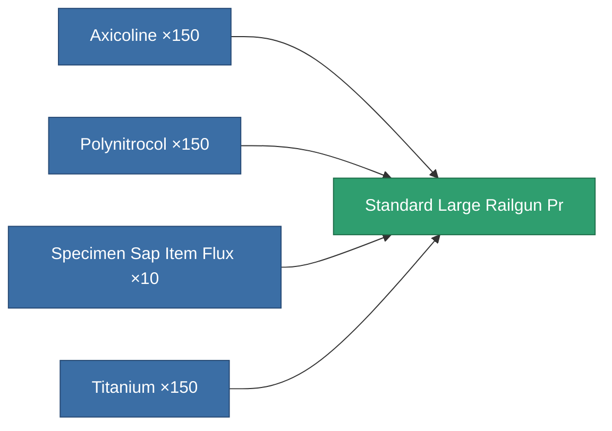

<!-- Generated by tools/generate from the live database (source: entitydefaults definition 5814, aggregatevalues via aggregatefields).
     Do not edit by hand; regenerate instead. -->

# Standard Large Railgun Pr

|  |  |
|---|---|
| Definition | `def_standard_large_railgun_pr` |
| Tier | – |
| Health | 100 |
| Volume | 1.5 |
| Mass | 1000 |
| Category | Modules / Weapons |
| Tier line | [Standard heavy Gauss gun](/content/items/standard-large-railgun/) (T1) → **Standard Large Railgun Pr** () → [Iskio-Magnetor II. heavy Gauss gun](/content/items/named1-large-railgun/) (T2) → [Nuimtec-Gaule heavy Gauss gun](/content/items/named2-large-railgun/) (T3) → [Pentack-Nailer dd550 heavy Gauss gun](/content/items/named3-large-railgun/) (T4) |
| Note | large weapon module |

## Stats

| Field | Value |
|---|---|
| accuracy | 40.5 |
| core_usage | 10.5 |
| cpu_usage | 80 |
| cycle_time | 6k |
| damage_modifier | 2.55 |
| falloff | 7.5 |
| optimal_range | 20 |
| powergrid_usage | 225 |

<!-- production:generated -->
## Production

**Produced from 4 components, research level 5** — assemble the components to build it (see [Recipes](/content/recipes/) for the full list):

[All items](/content/items/)
