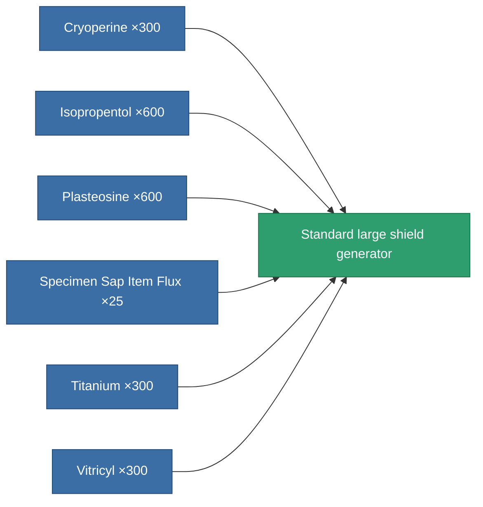
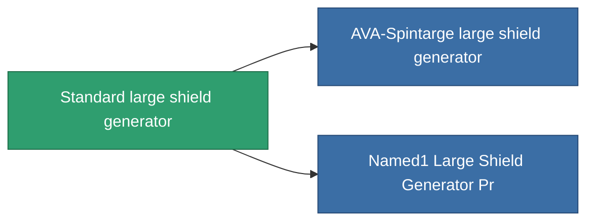

<!-- Generated by tools/generate from the live database (source: entitydefaults definition 30, aggregatevalues via aggregatefields).
     Do not edit by hand; regenerate instead. -->

# Standard large shield generator

|  |  |
|---|---|
| Definition | `def_standard_large_shield_generator` |
| Tier | T1 |
| Health | 100 |
| Volume | 1 |
| Mass | 800 |
| Category | Modules / Shield |
| Tier line | **Standard large shield generator** (T1) → [AVA-Spintarge large shield generator](/content/items/named1-large-shield-generator/) (T2) → [Gegel Ioner large shield generator](/content/items/named2-large-shield-generator/) (T3) → [Umbeler large shield generator](/content/items/named3-large-shield-generator/) (T4) |

## Stats

| Field | Value |
|---|---|
| core_usage | 30 |
| cpu_usage | 325 |
| cycle_time | 10k |
| powergrid_usage | 1.25k |
| shield_absorbtion | 1.9048 |
| shield_radius | 30 |

<!-- production:generated -->
## Production

**Produced from 6 components** — assemble the components to build it (see [Recipes](/content/recipes/) for the full list):

## Used in production

**Component of 2 items** — everything that uses it in production:

[All items](/content/items/)
