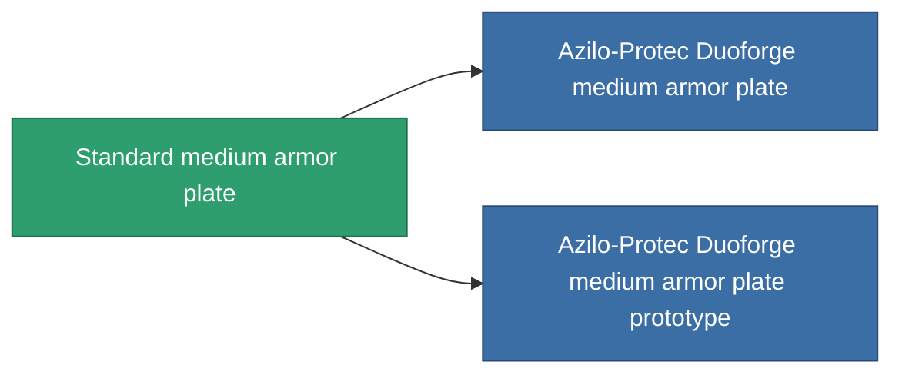

<!-- Generated by tools/generate from the live database (source: entitydefaults definition 16, aggregatevalues via aggregatefields).
     Do not edit by hand; regenerate instead. -->

# Standard medium armor plate

|  |  |
|---|---|
| Definition | `def_standard_medium_armor_plate` |
| Tier | T1 |
| Health | 100 |
| Volume | 2 |
| Mass | 3000 |
| Category | Modules / Armor |
| Tier line | **Standard medium armor plate** (T1) → [Azilo-Protec Duoforge medium armor plate](/content/items/named1-medium-armor-plate/) (T2) → [Invigor II. medium armor plate](/content/items/named2-medium-armor-plate/) (T3) → [THL-Testudo medium armor plate](/content/items/named3-medium-armor-plate/) (T4) |

## Stats

| Field | Value |
|---|---|
| armor_max | 1.35k |
| cpu_usage | 2 |
| massiveness | 0.12 |
| powergrid_usage | 75 |
| signature_radius | 1 |

<!-- production:generated -->
## Production

**Produced from 2 components, research level 3** — assemble the components to build it (see [Recipes](/content/recipes/) for the full list):

<svg class="prod-card-icon" aria-hidden="true"><use href="#mi-grid"/></svg><a class="prod-card-name" href="/content/items/plasteosine/">Plasteosine</a>

required: <b>700</b>

<svg class="prod-card-icon" aria-hidden="true"><use href="#mi-grid"/></svg><a class="prod-card-name" href="/content/items/titanium/">Titanium</a>

required: <b>500</b>

## Used in production

**Component of 2 items** — everything that uses it in production:

