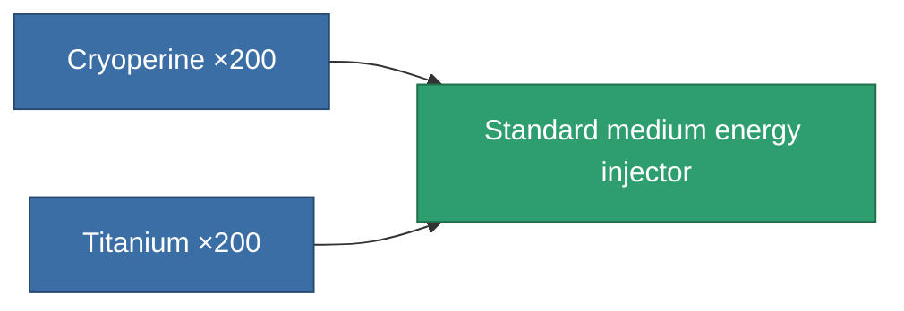
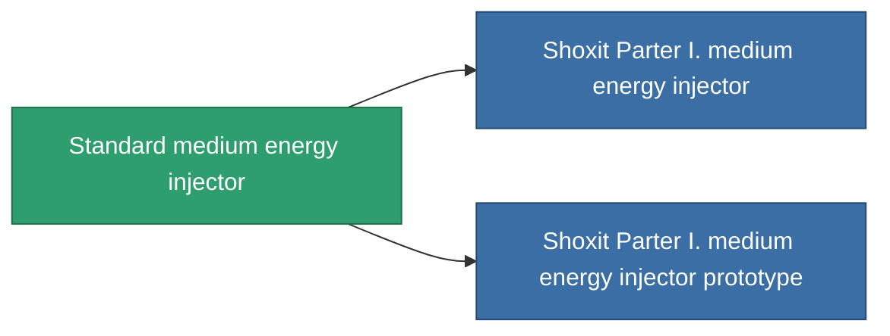

<!-- Generated by tools/generate from the live database (source: entitydefaults definition 649, aggregatevalues via aggregatefields).
     Do not edit by hand; regenerate instead. -->

# Standard medium energy injector

|  |  |
|---|---|
| Definition | `def_standard_medium_core_booster` |
| Tier | T1 |
| Health | 100 |
| Volume | 1 |
| Mass | 200 |
| Category | Modules / Enhancements |
| Tier line | **Standard medium energy injector** (T1) → [Shoxit Parter I. medium energy injector](/content/items/named1-medium-core-booster/) (T2) → [Follypsos medium energy injector](/content/items/named2-medium-core-booster/) (T3) → [Cerepter II. medium energy injector](/content/items/named3-medium-core-booster/) (T4) |

## Stats

| Field | Value |
|---|---|
| core_usage | 0 |
| cpu_usage | 25 |
| cycle_time | 11k |
| powergrid_usage | 250 |

<!-- production:generated -->
## Production

**Produced from 2 components, research level 4** — assemble the components to build it (see [Recipes](/content/recipes/) for the full list):

## Used in production

**Component of 2 items** — everything that uses it in production:

[All items](/content/items/)
