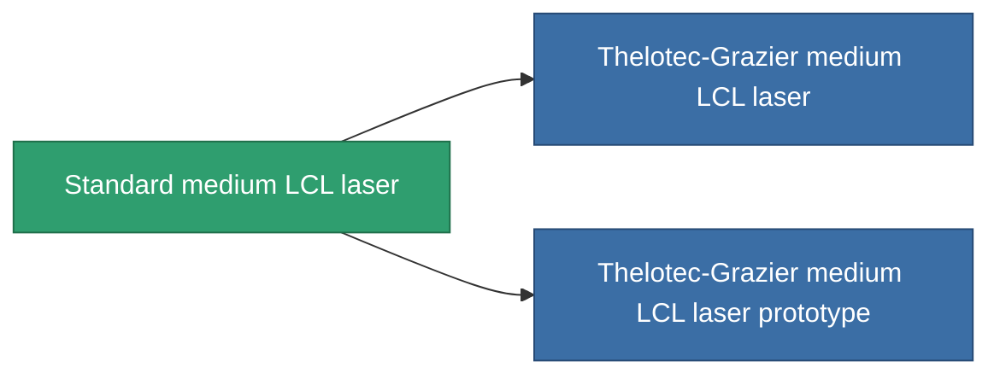

<!-- Generated by tools/generate from the live database (source: entitydefaults definition 58, aggregatevalues via aggregatefields).
     Do not edit by hand; regenerate instead. -->

# Standard medium LCL laser

|  |  |
|---|---|
| Definition | `def_standard_medium_laser` |
| Tier | T1 |
| Health | 100 |
| Volume | 1 |
| Mass | 500 |
| Category | Modules / Weapons |
| Tier line | **Standard medium LCL laser** (T1) → [Thelotec-Grazier medium LCL laser](/content/items/named1-medium-laser/) (T2) → [Kauska Heatpin I. medium LCL laser](/content/items/named2-medium-laser/) (T3) → [Thermodissector medium LCL laser](/content/items/named3-medium-laser/) (T4) |

## Stats

| Field | Value |
|---|---|
| accuracy | 11.5 |
| core_usage | 16.8 |
| cpu_usage | 25 |
| cycle_time | 5k |
| damage_modifier | 1.275 |
| falloff | 10 |
| least_optimal | 5 |
| optimal_range | 17.5 |
| powergrid_usage | 200 |

<!-- production:generated -->
## Production

**Produced from 3 components, research level 4** — assemble the components to build it (see [Recipes](/content/recipes/) for the full list):

<svg class="prod-card-icon" aria-hidden="true"><use href="#mi-grid"/></svg><a class="prod-card-name" href="/content/items/axicoline/">Axicoline</a>

required: <b>100</b>

<svg class="prod-card-icon" aria-hidden="true"><use href="#mi-grid"/></svg><a class="prod-card-name" href="/content/items/polynucleit/">Polynucleit</a>

required: <b>100</b>

<svg class="prod-card-icon" aria-hidden="true"><use href="#mi-grid"/></svg><a class="prod-card-name" href="/content/items/titanium/">Titanium</a>

required: <b>100</b>

## Used in production

**Component of 2 items** — everything that uses it in production:

