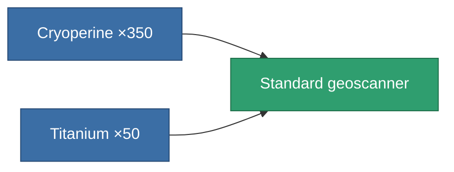
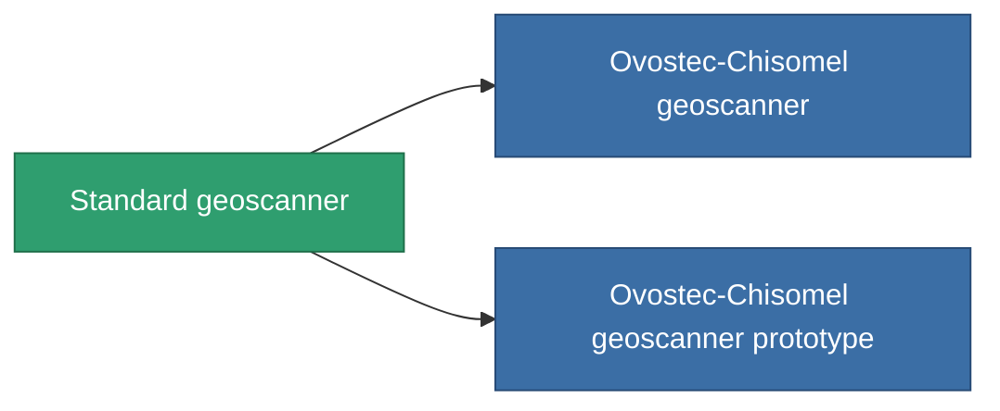

<!-- Generated by tools/generate from the live database (source: entitydefaults definition 228, aggregatevalues via aggregatefields).
     Do not edit by hand; regenerate instead. -->

# Standard geoscanner

|  |  |
|---|---|
| Definition | `def_standard_mining_probe_module` |
| Tier | T1 |
| Health | 100 |
| Volume | 1 |
| Mass | 200 |
| Category | Modules / Enhancements |
| Tier line | **Standard geoscanner** (T1) → [Ovostec-Chisomel geoscanner](/content/items/named1-mining-probe-module/) (T2) → [Syverz geoscanner](/content/items/named2-mining-probe-module/) (T3) → [Eksplor-q3000 geoscanner](/content/items/named3-mining-probe-module/) (T4) |

## Stats

| Field | Value |
|---|---|
| core_usage | 60 |
| cpu_usage | 45 |
| cycle_time | 15k |
| mining_probe_accuracy | 0.5 |
| powergrid_usage | 50 |

<!-- production:generated -->
## Production

**Produced from 2 components, research level 1** — assemble the components to build it (see [Recipes](/content/recipes/) for the full list):

## Used in production

**Component of 2 items** — everything that uses it in production:

[All items](/content/items/)
